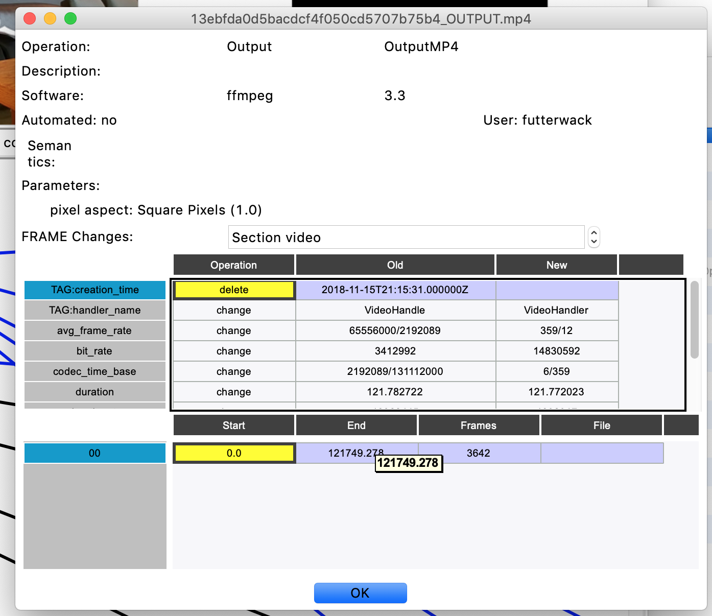
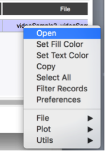
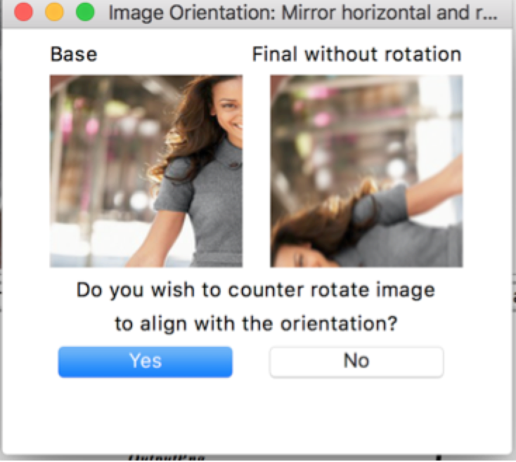

# WHAT IS THIS?

This tool is used to journal image, video and audio manipulations applied to high provenance media to produce manipulated media.  The intent is to capture all the steps for the purpose of evaluating effectiveness and accuracy of manipulation detection algorithms, training detectors and evaluating manipulation software for their effectiveness and correctness.  The tool has numerous pluggable components including validation rules, mask generation rules, summarization rules, image readers, and image manipulation plugins.

# PHILOSOPHY

Each manipulation performed on media is an isolated single manipulation given a source media file and target file.  This requires the result of a manipulation to be saved after each manipulation step. A subsequent manipulation step must continue from the 'saved' media from the preceding step.  Operations cannot be combined.  Operations cannot have side-effects.  The journaling tool creates change masks and meta-data capturing each differences in the state of media between before and after manipulation.

When applying a new manipulation to media after a preceding one, it is critical that starting point be the saved result of the preceding manipulation.  A common mistake occurs during the export of a manipulation result.  Manipulation tools such as Adobe Photo Shop support export options.  These options essential re-encode the result to be stored on disk.  The saved result must be a pure reflection of the manipulation, without side-effects from the encoding process.   Thus, Uncompressed images PNG (RGB) and AVI (RAW) are the best options for recording results.  Be careful when exporting videos.  Any compressiong or translation to YUV (e.g. as commonly done in H264), is a side effect.  The journaling tool compensates for some of the translation, but each encoding adds 'noise'.  Always used fixed frame rates.

This detailed methodical capture should not detract from individualistic approaches to assembling final media products.  Often, image fabricators like to play with many layers, exposing layers in a final mathematical blended result embodied by rendering.   Although this is the ultimate outcome, the composition must be broken down into each individual manipulation.   

Always keep the core goals of journals and media in mind.  Given that we want fabrications to fool a human inspection using 'eyes' only, the corpus of journals aids in the development image science algorithms that aid inspection anddiscovery of manipulations not easily caught with the human eye.   To develop algorithms, image scientist need accurate, discernable data to train and test their algorithm, evaluating the effectiveness of their algorithm across a broad range of manipulations.  In the end, it is unlikely that any one algorithm is good a discoverying all manipulations.  Algorithms tend to specialize, requiring the use of multiple approaches to analyze manipulated media.     Understanding the performance envelope of each algorithm establishes confidence in the algorithms analytic results.

The goals of each journal include:

* Factor Analysis to determine what types of manipulations make fabrications difficult or easy to detect.
* Factor Analysis to determine what order of manipulations make fabrications difficult or easy to detect.
* Extensibility to permit the addition of new manipulations at ANY intermediate point in the journal.
* Accurate training data so that machine leaning based algorithms can learn the 'tells' of individual operations and combination of operations of manipulated media.

# Detailed Documents

For the most up-to-date detailed documentation, see doc/MediForJournalingTool-public.pdf. This README is a summary.

See see documentation [here](doc/API.md) for details on the python API.

See see documentation [here](doc/NewOperation.md) for details on the operations, written in terms of creating new operations.

See see documentation [here](doc/ProjectProperties.md) describes journal project properties.

See see documentation [here](doc/MediForJournalingTool-Batch-public.pdf) describes batch journal creatiton and extension.

See see documentation [here](doc/Seam.pptx) describes the components of JT's seam carving plugin.

See see documentation [here](doc/BatchWithMSCOCO.pptx) describes the use of MSCOCO with batch journal creation.

For developers, documentation [here](doc/NewFileType.md) describes steps to add category of media type in addition the current set of video, audio, image and zip (of images).

# INSTALLATION

This section discusses installing dependent packages by hand.  When possible, use one of the existing installers for Windows, Mac and Ubuntu.

The tool uses Python 2.7.  An upgrade to Python 3 is not planned at this time.   Please use the latest version of python 2.7.  Python versions prior to 2.7.12 do not work with this software.  The software relies on setuptools.  You can install setup tools as follows:

```
pip install --upgrade setuptools pip
```

The tool uses an extension to setuptools to manage versions.  The tool only needs installation once.

~~~
cd setuptools-version
python setup.py install
~~~

Wrappers are used to support loading media that is not directly supported by the tool, such as JPEG2000.  You may wish to install these wrappers if you intend to use the associated media types.  All wrappers are found in the wrapper_plugins subirectory.

~~~
cd wrapper_plugins/jpeg2000_wrapper
python setup.py install
~~~

This tool is dependent on FFMPEG, OpenCV, exiftool, AWS cli and graphviz.  Install these first.  Some helpful instructions are provided below.

The main tool is installed with:

~~~
python setup.py install
~~~

Use one of the installers from the scripts directory.  Windows uses nsis.sourceforge.net. 

### FFMPEG and OpenCV
For Anaconda users, the windows installer sets up the following installation.

*	Dowload and install FFMPEG.  FFMPEG's ffprobe 3.4.x does not work correcly on Windows.
*	Download and install opencv 3.x from opencv.org using the appropriate architecture (x86 or x64).  Make sure it is built with FFMPEG.   
  *	You may need to copy opencv/build/python/2.7/x64/cv2.pyd (or x86/cv2.pyd for the x86 architecture) to Anaconda2/Lib/site-packages
*	Set environment variables:
*	32-bit: Set OPENCV_DIR to the absolute path of opencv/x86/vc[nn]
*	64-bit: Set OPENCV_DIR to the absolute path of opencv/x64/vc[nn]
*	Add to PATH: %OPENCV_DIR%\bin
*	Add to Path: FFMPEG’s bin directory

### FFMPEG (not Anaconda): 

ffmpeg should installed with x265 and x265 codecs prior to installing python package.
For example, a Mac user can use the following command.
```
brew install ffmpeg --with-fdk-aac --with-ffplay --with-freetype --with-libass --with-libquvi --with-libvorbis --with-libvpx --with-opus --with-x265
```

```
pip install ffmpeg
```

## GRAPHVIZ:
###MAC

```
brew install graphviz
pip install pygraphviz
```
See http://www.graphviz.org/Download..php for other options.

###WINDOWS

1.	Download the current stable release from http://www.graphviz.org/Download_windows.php. Get the .msi, not the .zip.
2.	Run the graphviz msi installer, and walk through the steps to install.
3.	Add the graphviz “bin” directory to PATH variable. Most likely will be C:\Program Files (x86)\Graphviz2.38\bin
4.	Restart computer to complete the install
5.	Pull down the correct wheel from http://www.lfd.uci.edu/~gohlke/pythonlibs/#pygraphviz and perform:
```
pip install pygraphviz-1.3.1-cp27-none-win_amd64.whl 
```

## tiffile

For use with using plugins that write TIFF files, install tifffile. For Mac users, XCode needs to be installed.  For Windows users, Microsoft Visual C++ 9.x for python needs to be installed.   An alternative is to find a prebuilt libtiff library for Mac or Windows.  Download at your own risk.

###Mac

```
pip install tifffile
```

###Windows

~~~
conda install -c conda-forge tifffile -y
~~~

###RAWPY

The installation may fail on installing rawpy.  Here other some other options, before restarting the install.

1. pip install rawpy (may still give the same error)
2. Pick and install the appropriate WHL from https://pypi.python.org/pypi/rawpy
3. Install git and rerun the setup.

### Logging

The default python 2.7.11 on Mac contains an old version of logging and an old
version of pip. The indication of a problem is an error message on
starting the JT, indicating a unknown symbol 'utc'. The first step is to
try to uninstall logging. This may leave an older version of pip in an
unstable state, indicated by an error message trying to resolve a
handler List. Here are the steps used to clean this problem.

```pip uninstall logging
brew upgrade python
rm -r /usr/local/lib/python2.7/site-packages/logging
rm -r /usr/local/lib/python2.7/site-packages/logging-0.4.9.6.dist-info/
sudo easy_install pip
```

# RESOURCES

The tool uses three key resource files: 
*	software.csv lists the permitted software and versions to select.  This enables consistent naming.
*	operations.json provides the description of all journaled operations and require parameters, along with defining validation rules, analysis requirements, and parameters.
*	project_properties.json defines all final image node and project properties.  Final image node properties are summarizations of activities that contributed to a final image node of a project.
  Resource files are stored in one of the following locations, searched in the order given:
  *	Directory as indicated by the MASKGEN_RESOURCES environment variable
  *	current working directory
  *	resources subdirectory
  *	The resource installation as determined by Python’s sys path.
*	ManipulatorCodeNames.txt
  *	This is an optional file that maintains a valid list of manipulation(user) names.  The choice of distribution is left to the organizational user.

# Usage

## Starting the UI


```
% jtuiw
```

The imagedir argument is a project directory with a project JSON file in the project directory.

An optional folder can be specified to open an existing journal directory or create a new journal using all the media in the provided directory.

```
% jtuiw --project directory_name
```

If the project JSON is not found and the provided imagedir folder contains is a set of images, then the images are sorted by time stamp, oldest to newest.  The first image file in the sorted list is used as the base image of the project and as a basis for the project name.  All images in the imagedir are imported into the project. An alternative base image can be chosen using the --base command parameter.  

```
% jtui  --project images --base images/baseimage.jpg
```

## Projects

The tool represents a project as a directory that contanins image or video assets, both original and manipulated, masks and a project file (.json).  The project file describes the project.  A directory should only contain one project file.  The tool 'Save As' function does not permit two project files residing in the same directory.  'Save As' copies the contents of the current project directory to another project directory.  

### File Management 

When images or videos are added to a project, if the source file does not already reside in the project directory, it is copied to the directory.  If an file with the same name already exists in the directory, a name is assigned (appending a integer to the existing name).  The file type is unchanched. Adding the same file to the project results in a two separate copies of the file and its contents.  

If a file is added to the project directory, then the file is subject to removal if the associated node is removed from the tool.  Removing a link between nodes (manipulation action) results in removing the associated mask.

## Video Projects

Video projects are similar to image projects.

If the project JSON is not found and the video directory contains is a set of videos, then the videos are sorted by timestamp, oldest to newest. The first video file in the sorted list is used as the base video of the project and as a basis for the project name.  All videos in the video directory are imported into the project. An alternative base video can be chosen using the --base command parameter. 

When using video, the displays used to show images show a select frame from the video.

## Artifacts

Artifacts are all files associated with links and nodes.  A node represents a single video or image.  A link represents a operation that created the destination artifact from the source node's artifact.

Links record a single action taken on one image to produce another.  A node can only have one input link (see Paste Splice below).  An image node can be the basis multiple different manipulations, each one distinct from the other, resulting in many different images.  A node may have many mant output links.

An image may have an additional Donor input link.  The Donor link represents a sequence of manipulations  that provide media used as an input to a manipulation.   For example, a Paste Splice operation uses a donor image pasted into a image.  The donor link is attached (input) to the node representing the result of the manipulation.

Consider the graph as both a sequence of steps and a dependency graph.  A node with a input manipulation and donor link portrays the dependency on both the basis media prior the manipulation and the donor media.  

Media cannot donate any property of the media, depending on the manipulation operation.   This includes meta-data, audio, video, captions, etc.

The main display is broken into three main components:

* Top: The current node or link selected. 
  * When Node is selected, the left image displays the node image.
  * Whe a Link is selected, the left image displays the image prior to the manipulation, the middle imag displays the image after the manipulation and the right image displays the change mask.  Black indiates changed pixels.  When representing a video, the images represent a single select frame.  For Audio media, an audio symbol is shown.
* Middle: graph view.
* Bottom: status bar showing in-process activities.


## Logging

Logs are maintained in maskgen.log.  Older log files are stamped with the day they were created.   Opening the tool automatically extends the current log file.  

# Menus

##File


**Open**: Open a projects JSON file.  The directory containing the JSON file is assumed to be the project directory.

**Open S3**:  Pull a project archive (tgz) from s3 and an open the file locally.

**New**: Creates a new project. Creating a new project will prompt the user for to select a base media file. The directory containing that media file becomes the project directory. The name of the project is based on the name of the media file, sans the file type suffix. All media in the directory are automatically imported into the project as nodes.

**Save**: Saves the current instance into the JSON data, and can be re-opened at a later time with **Open**.

**Save As**: Copies the contents of the current project directory into another directory, with the option of re-naming the project.

**Save Graph Image**: Save a graph depiction of the project with thumbnails in a PNG file (using graphviz/dot)

**Export -- To File**: will create a compressed archive file of the project, including all media and masks. Export also validates the project, running the graph rules, builds composite masks and calculates summary information for final media nodes as described by rules in project\_properties.json (those properties with 'node' : true). Export creates a 'dot' graphic called \_overview\_.png in the archive.

**Export -- To S3**: creates a compressed archive file of the project and uploads to an S3 bucket and folder. The user is prompted for the bucket/folderpath, separated by '/'. Export also validates the project, running the graph rules, builds composite masks and calculates summary information for final media nodes as described by rules in project\_properties.json* (those properties with 'node' : true). Export creates a 'dot' graphic called \_overview\_.png in the archive.

**Export -- Manager**: A tool to track export jobs of journals.  Multiple journals can be in the process of export at one time.  The manager tracks the progress of transfering the packaged journal archive (TGZ) to S3.

**Fetch Meta-Data (S3)**: Prompts the user for the bucket and path to pull down all resource files including *operations.json*, * project\_properties.json*, *ManipulatorCodeNames.txt* and *software.csv* from an S3 bucket. The user is prompted for the bucket/folderpath, separated by \'/\'. The files are pulled down to the current working directory or the directory as indicated in the environment variable MASKGEN\_RESOURCES, if set.

**Build Plugin**: Permits the user to create a plugin based on a command-line accessible tool such as ImageMajick andGimp (headless).

**Filter Group Manager**: Opens a separate dialog to manage groups of plugin filters. Filters can be run in a sequence, where the output of one feeds another, or as a spread, sharing the same input node.

**Operations Group Manager**: Opens a separate dialog to manage groups of operations. Grouping operations treats the group as one atomic operation (on one link). This is only possible if the individual operations do not require their own change mask.

**Rename to Base**: Rename a project to match one of the base media.

**Settings - Username**: Allows the user to set the username attached to project links.  By default, the operating system's user name is used.

**Settings - Filetypes**: Allows the user to add additional file types to loading media.

**Settings - AutoSave**: Set the number of seconds to automatically save the project.

**Settings -- Skip Link Compare**: Allows the user skip link comparison (mask generation) until validation or export time. Link comparison may be time consuming for video journals.  The link comparison will be run prior to Quality Assurance (QA).  If skipped, the first time opening QA may take a while.

**Settings --Trello API Key**: Notfications of journal export may be sent directly to a Trello card. The trello list is the user name. The card is the project name.

**Properties**: Allows user to give project a description and technical summary. This may detail the specific scenario assigned to the project, and/or any other relevant information. Properties are defined in resource *project_properties.json*.

**Reload Plugins**: Rescan the plugin directories for new or updated plugins.

**System Check**: Checks to see if the system is installed properly with all the dependencies.  The log file contains the detailed results.


### Process


**Add Media**: Add a media file selected via file browser to project. The media can be linked to other media nodes within the graph.

**Add CGI** Similar to add media, adds media to the tool. The media is marked a computer generated (e.g. model, GAN, etc.).

**Next w/Auto Pick**: Automatically picks an media node without neighbors. The chosen media node is the next node in found in lexicographic order. Preference is given to those media nodes that share the same prefix as the currently selected node. A dialog appears for to capture the manipulation information including the type and additional description (optional). The dialog displays the next selected media as confirmation. A link is formed to the current media to the next selected media node.

**Next w/Auto Pick from File**: Finds a modified version of current media file from the project directory. The modified version of the file contains the same name as the initial media file, minus the file type suffix, with some additional characters. If there is more than one modified version, they are processed in lexicographic order. A dialog appears for each modification, capturing the type of modification and additional description (optional). The dialog displays the next selected media as confirmation. A link is formed from the current media to the next selected media file.

**Next w/Add**: See Next w/Auto Pick, except the journaling tool will instead prompt the user to add the next file in manipulation sequence, instead of automatically selecting it.

**Next w/Filter**: Will add a new, original node created by a applying an operation to the currently selected media node. Unlike the other two \'next\' functions, the set of operation is limited to those available from the tool\'s plugins. Furthermore, the media shown in the dialog window is the current selected media to which
the selected modification is applied.

**Create JPEG/TIFF**: Runs either the 'CompressAs' (JPEG) or 'OutputTIFF' (TIFF) plugins on all end nodes, using the base node as donor. For JPEGs, this will save the end node media in JPEG format using the same quantization tables as the base media. It will also copy the EXIF data from the base media. For TIFFs, this will just save the media as TIFF and copy as much metadata as possible. This option should only be used at the end of processing.

**Rename File Media**: Rename final media to their MD5 name, retaining the suffix.

**Undo**: Removes the [last]{.underline} operation performed. The tool does not support undo of an undo.

### *Difficulty Loading Media*

Some raw image formats, TIFF files and PDF files can pose a problem for cv2, tifffile, Pillow, rawpy and PyPDF2, thus exhausting the packages loaded into the tool. The tool's primary image file is PNG. Upon difficulty loading an image, remove the image node, create a copy of the image in PNG format with the file name ending with '\_proxy.png', select the image node right-button menu, select 'Proxy', select the proxy PNG file. The PNG will serve as a visual proxy.


For example, suppose the desired file is an odd TIFF format with the
name 'troubleimage.tif'. Create a PNG version of that image called
'troubleimage\_proxy.png' within the project directory prior to adding
the TIFF image file.

### Image Loading Plugins

An alternative to loading raw images into the tool is to provide a
custom plugin. These plugins are not incorporated into the tool be
default to manage the dependencies. A plugin is a python function that
accepts a string file name and returns a tuple:

- *numpy* ndarray of the image (height, width, channel).
- The string mode according the PIL Image specifications *(e.g. RGB)*

The function is registered with the tool by registering any entry point
called maskgen\_image the setup.py. The definition is composed of a list
of equations of the form:

*File type suffix = package.module:function*

~~~
entry_points= {'maskgen_image': ['cr2 = rawphoto_wrapper.opener:openRawFile']}
~~~

The package layout is as follows.

topfolder/

​	 setup.py

​	 \_\_init\_\_.py

​		packagename/

​			modulename.py

Upon installing the package, a JT can discover the function through the
entry point.

### Validate


**History**: Provides a tabular history of edits

**Validate**:  Run project validation rules. This may take a little while since external systems may need to validate the media against duplicates, in proper program use, etc. 

**QA...**: Inspect the Probes.  Each probe is a 'blue link' selected to be represented in the final composite masks for the project.

**View Comments**: View an edit comments associated with the journal project.

**Clone Input Mask**: Finds all links whose operation requires an input mask file for which it is missing.  Attempt to ascertain the mask by looking at the before and after media of a manipulation.

**Final Image Analysis**: Bring a up a viewer to apply analytics to final images.  Analytics look for obvious signs of manipulations, providing an initial quality assessment to the manipulation and subsequent AntiForensics.

**Probes**: Generate probes bypassing QA to store in a CSV on disk.

**Recompute All Masks**: A very expensive operation to recompute all edge masks.  

**Edit All Semantic Groups**: A tool uses to bulk replace or remove semantic groups used in the journal.

### View

The manipulation graph may grow fairly complex. The graph view permits LASSO of several nodes to move nodes in bulk, in the effort to format the graph for readability. Another option is to use the **Reformat** graph option. The reformat attempts to come up with a graph layout that is easy read, using Graphviz's[^2] directed-graph *dot* layout.

### Node Menu


**Select**: Select the node to extend with a manipulation.

**Edit**: Edit Node Properties.  Node properties include if the media is CGI or GAN generated.

**Connect To**: Move into 'connect to' mode to support using the selected node as the source of manipulation.  The '+' cursor is enabled.  Click another target node to initial the creation of a link.  The user will prompted for link details including operation name.

**View Composite**: View color representation of the composite image up to the selecte point in graph.  The composite is color image representing all manipulations prior to the selected image node, overlayed on the target image. Some manipulations are obfuscated by others.  The composite image is helpful in determing which operations 'composite mask rules' distorted the prior image masks.  This gives a clue to misrepresented or misentered information for a prior link.   

> Does not function for videos at this time.

**View Donor**: View color representation of the donor image for selected point in graph to the donor's base image.  The donor is an image represents overlayed on the donor base image.  The donor image is helpful in determing which operations 'composite mask rules' distorted the donor image masks.  This gives a clue to misrepresented or misentered information for a prior link along the donor path.

> Does not function for videos at this time.

**Remove**: Remove the Node and all associated links.

**Compress**: Compress the node's media in using a lossless compression, if possible.

**Analyze**: Bring a up a viewer to apply analytics to the image.  Analytics look for obvious signs of manipulations, providing an initial quality assessment to the manipulation and subsequent AntiForensics.

**Proxy**:  Replace the node's media with a proxy media that the JT can read.  This is used if the node's media is not supported by the JT or one of the provided image reading plugins.   It is recommended to try to use a plugin for a more accurate presentation.

### Link Menu


**Select**: Select the Edge, displaying the source, target and mask in the image pane.

**Edit**: Edit the edge properties (the operation). Plugin generated links are not editable.

**Inspect**: Inspect edge properties.

**Remove**: Remove the link and associated mask data.

**Composite Mask**: Set the mask as a blue link to be included in the journal's probe set for test and evaluation.  All blue links are inspected in QA.  The Composite Mask is the link mask overlayed on a final media node.

For images, the JT can replaced the JT generated mask  for each final node.  This is required if, along the path to the final node, a transformation is unable to properly align the edge mask to the final node.   The Composite Image is the spatial/temporal dimensions of the selected final media. Before doing this, try two other things:

* Determine which subsequent operation is applying the incorrect transformation and trying chang its parameters.
* Report the concern to the development team as this may be a bug or unexpected usecase requiring software development.

**View Overlay Mask**: The view edge mask over specific final media nodes.  This essentially a QA for a single link. 

**Recompute Mask**: Sometimes the JT does not have the current mask.  This occurs if the user changed the media or the media was not in sync with the journal.

**Invert the Mask**: Black = manipulated pixels.  If mask is inverted where white pixels represented manipulatd pixels, then use this link function to invert the mask.

## Workflow

There are two primary ways to use the journaling tool: The first is to directly export manipulation steps into separate media as the manipulations are made. Exporting every step will be very tedious, but also helpful if a mistake is made. **All intermediary steps should be exported as .PNG** for media and raw or lossly compressed format for other media. An example workflow for this method would be:

1. Create directory.
2. Copy the desired image to manipulate to the directory.
3. Open Image in Manipution Tool on the desied image.
4. Export image as PNG.
5. Crop.
6. Export as PNG.
7. Adjust Contrast 
8. Export as PNG 
9. Clone
10. Export as PNG
11. Run Journaling Tool with the specific directory, selecting the base media as the base node.
12. Connect all the images using the graph 'Connect To'

The second way is to "save-as-you-go," that is, save over the same media each edit. The journaling tool makes copies of the imported images, and therefore it is possible to load multiple instances of the same file as different nodes. An example workflow for this method would be:

1. Create directory.
2. Copy the desired image to manipulate to the directory.
3. Run Journaling Tool with the specific directory, selecting the base media as the base node.
4. Open Image in Manipution Tool on the desied image.
5. Export image as PNG.
6. Add Image to Journal with operation OutputPng using Next W/Auto Pick (Ctrl-P)
7. Crop and save as PNG.
8. Add Image to Journal with operation TransformCrop using Next W/Auto Pick (Ctrl-P)
9. Adjust Contrast and save as PNG.
10. Add Image to Journal with operation Contrast using Next W/Auto Pick (Ctrl-P)
11. Paste Clone and save as PNG.
12. Add Image to Journal with operation PasteClone using Next W/Auto Pick (Ctrl-P)


> CAUTION: Make sure the tool works on the saved result. If the export is different in format from the working copy, the journal will be incorrect. For example, exporting to a lossless format while working with a lossy format introduces inconsistencies in the media.

The journaling tool has the ability to automatically select the next modified media in the directory (see section 3.3: Processing). To use this feature, media manipulation steps should be saved out in numerical order (e.g. media\_mod\_01.png, media\_mod\_02.png, etc).

# Graph Operations

The graph viewer is an interactive display. The left mouse enables moving of a single node or a group of nodes (Lasso).

When selecting a group of nodes, the selection box must include the nodes full text. The right mouse button (and double click) selects a node or edge, prompting the user with a menu. Node menu options include inspecting composite masks, removing nodes, exporting and all its dependencies to an archive (subset project).  Link menu options include edge inspection, edge editing, edge removal, and composite mask selection and inclusion.

All nodes are effectively the same. From a terminology standpoint, a node that does not have any in-bound links is a base media node. A base media represents an un-manipulated starting media. The base media may either be the basis for a final media or a donor to the final media. A donor media provides some part of the media to a final media.

Final media do not have any outgoing edges. A project may produce more than one final media. It is best practice to have a single base media (not including donors) for all final media. Thus, each project represents all manipulated artifacts applied to single base media.

 

## Linking Nodes

Links record a single action (manipulation) taken on one media to produce another. A media node has only one primary input link. Some links allow donor links. These links are supporting the operation link. They are represented graphically as links for clarity.

A media node can contribute to multiple different manipulation paths resulting in many different media. Therefore, a media node may have several output links. A helpful graphical description of the UI is shown on the following page.

Media nodes may be selected, changing media display. The media associated with selected media node is shown in the left most media box. The right two boxes are left blank. Media nodes can be removed, and all input and output links to that node are removed as well. Media can be connected to another media node. When \'connect to\' is selected, the cursor changes to a cross. Select another media node that is either a media node to which to connect.

Media nodes may be exported. Exporting a media node results the creation of compressed archive file with the node and all edges and nodes leading up to the node. The name of the compressed file and the enclosed project is the node\'s media name (replacing \'.\' with \'\_\').

Links may also be selected, changing the media display to show the output node, input node and associated difference mask. Editing a link permits the user to change the operation and description. Links created using a plugin operation (\[Process Next w/Filter \[Ctrl-f\]) cannot be edited. They may be inspected. Inspection opens a separate window with the description of the link.

### Video Displays

When working with video nodes, media displays contain a frame from the video. The tool selects the most diverse in color ranges over the first 25 frames of the video.

Each media display is a button. Click on the media opens the media in the default system viewer. In the case of videos, the default system viewer is a movie player.

# Link Descriptions

Link descriptions include a category of operations, an operation name, a free-text description (optional), and software with version that performed the manipulation. The category and operation are either derived from the *operations.json* file provided at the start of the tool or the plugins. Plugin-based manipulations prepopulate descriptions. The software information is saved, per user, in a local user file. This allows the user to select from software that they currently use. Adding a new software name or version results in extending the possible choices for that user. Since each user may use different versions of software to manipulate media, the user can override the version set, as the versions associated with each software may be incomplete. It is important to maintain the software.csv to with the appropriate versions and work with centralize management of software.csv for consistency. Invalid versions and software fail the project validation.

 Each parameter in the parameters list is editable. The description for the parameter is shown in a dialog by clicking on the parameter name (button). The tool prompts with a file selection window for parameters associated with file names. The tool validates parameter values collected from text entry type dialogs. Guidance on the semantics and syntax for each parameter is given within the parameter description.

Some parameters are mandatory. The link edit window cannot be closed without providing valid values for each mandatory parameter.

### Input Masks

Link descriptions can include an input mask. An input mask is a mask used by the software as a parameter or set of parameters to create the output media. For example, some seam carving tools request a mask describing areas targeted for removal and areas for retention. This mask may be used as the input mask for the journaling tool as well. The input mask is an optional attachment, but it **should be used** for any operations that operate on a specific region of the media. When first attached to the description, the mask is not shown in the description dialog. On subsequent edits, the media is both shown and able to be replaced with a new attachment.

Input masks are inverted from changes masks\--high intensity (255) indicated selection. Low intensity (0) indicates no selection.


Video input masks may be a single media applied to multiple frames (detected in the change mask), or a set of frames as a movie clip.

### Link Inspection

Regardless if the link is read-only (for links created by plugins) or created through one of the media connection operations, a link may be selected and inspected.  The inspection includes all parameters, an input mask if provided, and an EXIF comparison analysis, as shown in the figures below. 


Video Links contain changes across the entire video stream. Changes are organized by steam. A selection drop down controls the section of data viewed in the subsequent meta-data change table. Global meta-data changes represent changes for the entire video file.

Meta data changes include property value changes, addition of frames and removal of frames. Frames are sequence and compared by presentation time stamp.

The tool displays presentation timestamps in fractional seconds (e.g. 13.480133).

Video masks are visible as a set of clips.  Video masks include temporal data including presentation time
stamp of the first frame the mask applies, shared between both streams. When adding or removing frames, the mask reflects those added and removed sequences.

> 

Masks are stored in HDF5[^3] format with the journal. Mask clips may be viewed with system default movie player by selecting 'Open' using the table row's right mouse-button enabled menu. Masks are converted on
demand to a playable format. The tool chooses m4v with the AVC1 codec. This default can be changed by editing *.maskgen2* JSON preferences file in the user's home directory as shown in the next example.

~~~
"vid_suffix":"mv4",
"vid_codec":"XVID"
~~~


> 

Figure : Video Mask Table Menu

### JPEG Workflow for JPEG Base Images

To avoid artifacts from recompression, all edits to a JPEG image shouldbe made on a lossless version of the image. Manipulators using the tool should:

1. Import the original JPEG image into the tool as the base image.
2. Export the JPEG image as PNG (lossless) and import the PNG image as the first step. This can be done automatically using the SaveAsPNG plugin (skip step 3).
3. Create a link with the operation 'OutputPNG' between the two nodes.
4. Perform manipulations as described above.
5. Use the Journaling Tool's 'Create JPEG/TIFF' option to save the image back as a JPEG and copy the metadata. This will use the base JPEG image as the donor for compression information.

#### A note regarding the 'Create JPEG/TIFF' option

The JPEG functionality of the Create JPEG/TIFF feature is a fairly powerful processing option to save all end image nodes in JPEG format using the compression (quantization tables) and metadata of the project's base image. It will also embed a thumbnail if the base image has one as well. If the user selects this feature, the journaling tool will automatically determine the base image and the relevant nodes to branch from, requiring no further input.

However, this feature is limited in the sense that the base image node must be a Jpeg (or TIFF). Individual operations may be performed by selecting the end node and performing the CompressAs plugin (Process\--Next w/Filter). This allows the user to select any node as a donor for quantization tables and metadata.

###Output PNG and Image Rotations

When exporting a JPEG image to PNG as the start of the manipulation process, the EXIF is stripped from the image. EXIF can have an Orientation attribute describing the orientation of the image. Some
export software (e.g. Adobe Photoshop) automatically rotates the image in accordance to the Orientation during export, as the exported image needs to reflect the proper orientation\--the guidance from EXIF is not longer present. Software may automatically rotate, prompt to rotate or not rotate on export. The manipulator must record whether the image was rotated during the OutputPNG operation when creating the OutputPNG link.

During a final 'Create JPEG', the operation adds the EXIF back into the final image, using the original JPEG as a Donor. Thus, the Orientation is re-applied to the image. The manipulator must decide if the image should be counter-rotated as part of this process. In general, the manipulator should counter-rotate if the manipulation software rotated the software during the initial OutputPNG step or the manipulator rotated the image manually, journaled as a separate step with a TransformRotate.

If an Orientation (other than standard) exists in the EXIF, the JT will present the user with a dialog window showing the base JPEG image and the final image with the Orientation applied if counter-rotation is not performed.




## Semantic Groups

Semantic groups are groups of operations that are used to achieve a specific semantic goal. Operations can be added or removed from a Semantic Group within an expandable section of the link edit window.


**Figure: Semantic Groups Entry**

Groups of edges can be assigned to a semantic group by selecting (lassoor shift-click) the source and target nodes for all the links the participate in the semantic operation, followed triggering the right click menu within the graph canvas and selecting the pop-up menu option 'Semantic Groups'.

> 

**Figure** **Semantic Groups** 

Semantic group participation is also verified for 'blue' links in the QA review window. The semantic groups appear between brackets next two the operation name.

> 

**Figure** **Semantic Group Review**


##Mask Generation

It most cases, mask generation is a comparison between before and after manipulations of an media. Full media operations like equalization,blur, color enhance, and anti-aliasing often effect all pixels resulting
in a full image mask. Since these operations may only effect some pixels (e.g. anti-aliasing), the mask does represent the scope of change.

The mask generation algorithm gives special treatment to manipulations that alter the image size. The mask is the same size as the source node artifact. The algorithm finds most common pixels in the smaller image to match the larger. This is useful in cropping OR framing. When cropping in image, the mask should include the frame around the cropped image. When expanding image, the mask represents the comparison of the most closely related area. If the expansion is due adding a frame, rather than some interpolation, then the mask will not reflect any change since the original pixels have not changed.

The mask generation algorithm also is sensitive to rotations, generating mask reflecting the image after rotation. A pure rotation with interpolation should have an empty change ask. Rotations are counter-clockwise in degrees. Consider a 90-degree rotation:interpolation is not needed and the mask is empty. When rotating 45 degrees, the size of the resulting image must increase to accommodate entire image. Since the mask size is the size of the initial image, the mask only indicates some distortion that occurred during the rotation. The mask is created by first reversing the rotation back to the originalimage orientation and size.

Many operations and the donor link use SIFT[^4] and RANSAC[^5] to generate a transformation matrix used for probe (composite) and donor mask generation. These masks are transformed masks aligned to their final or base image, respectively. For details on how to use these parameters, visit section QA Process.

## Video Mask

Video masks are organized by video clips per section of the video affected by the change. The masks are labeled with the start time in the source video where the change is detected. There may be more than one video clip/segment. Each segment is stored in HDF5 files[^6]. Clips are viewable by conversion to a video format. The tool will do this automatically upon opening a clip, provided OpenCV is installed properly

## Probe/Composite Mask

The individual link masks must be aligned to the final media temporally and spatially.   Each subsequet operation on the path from a manipulation link to a final media may have spatial and temporal side-affects on a link mask.  The tool uses rule attached to each operation to transform the link mask into the space of the next media along the path, eventually aligning the final media.  These transformed masks are called probes.  There is probe for each link mask and each final media reachable in the graph from the associated link.

Only 'blue link' masks, those selected for composite viewing, are represented as proves and reviewed in QA.    Certain links must be labeled 'blue', such as Paste Splice.  An validation error occurs if they are not labeled as composite/blue.  The status of the link can changed with the *Composite Mask* menu option. Furthermore, the mask used for the composite can override the link mask, as a substitute.

The media manipulator should not include all masks in the project. The media manipulator should therefore ensure the composite mask accurately reflects ALL LOCALIZED changes, and only localized changes, to a manipulated node from the base node. For example, a global saturation adjustment should not be included in the mask, while a Paste Sampled should.


Figure : Composite Mask

Composite masks are composed of RGB colored pixels, each color is associated with a single link. When a pixel is modified by more than one operation, the color of the last operation is applied to that pixel.Composite masks may also be JPEG2000 bit planes. 

# Export

Export performs the following steps:

- Validates the project. The user is prompted to continue if errors are found.
- Performs final analysis for final image nodes using rules within the project\_properties.json. The results are placed in the 'pathanalysis' attribute of the final image nodes.
- Strips out unused images and videos.
- Saves the project.
- Creates an PNG file of the graph: \_overview\_.png.
- Creates a gzipped tar file of the used contents of the project along with the project JSON file.

The Export Manager tracks export jobs.  Multiple exports can occur simultaneously.  If the JT exists or fails, the exports continue.  An export job can be stopped and restarted.  The export manager provides a view until all jobs past and current.


# Group Manager

The Group Manager allows the user to create, remove and manage groups.
There are two types of groups:

1. Groups are sets of plugin image transforms. Only those transforms that do not require arguments are permitted within the group at this time.
2. Groups are sets of operations that are collectively used to manipulate an image or video. The group represents a new operation listed under the 'Groups' category. When used, the group operation name is placed in the link 'op' description. The journal JSON file,under the 'graph' key, contains 'groups' key that lists the operations used as part of the the group operation, thus retaining the definition of that group at the time it was used in the specific journal.

~~~
{
  "graph": {
	"groups": {
		"myop": ["Blur","Sharpening"]
     }
  }
}
~~~


