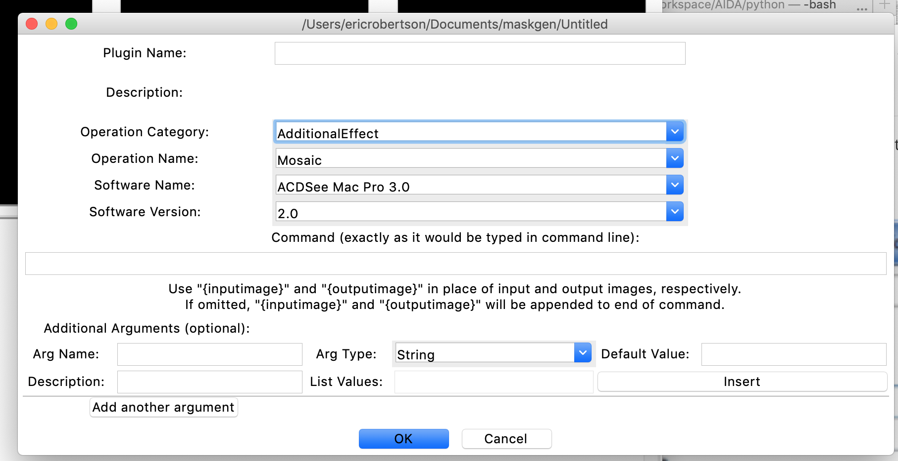

# Logging

The tool logs everything using python's logger.  The default setup uses command line and the maskgen.log file.  The file is rotating over each day.  The logger is registered as 'maskgen'.  

*To override this logger settings, perform the override after import maskgen.*

# Journal

## Create a Journal

A journal can be created in a directory, preloading all image files in the journal.

`from maskgen.scenario_model import createProject`

```
def createProject(path,
                  notify=None,
                  base=None,
                  name=None,
                  suffixes=[],
                  tool=None,
                  username=None,
                  organization=None,
                  preferences={}):
    """
    :param path: directory name or JSON file
    :param notify: function pointer receiving the image (node) id and the event type
    :param base:  image name
    :param username: the username of the person creating the journal
    :param suffixes: limit the images to load by suffixes
    :param organization: the organization of the person creating the journal
    :param preferences: attributes attached to each node loaded in the creation process
    :return:  a tuple=> (a project if found or created, boolean indicator)
              Boolean indicator =  True if created.
              Boolean indicator =  False if found.
              The expected return value is None if a project cannot be found or created.
     @type path: str
     @type notify: (str, str) -> None
     @rtype (ImageProjectModel, bool)
    """
```

This utility function creates an ImageProjectModel given a directory.  If the directory contains a JSON file, then that file is used as the project file.  Otherwise, the directory is inspected for images. All images found in the directory are imported into the project.  If the 'base' parameter is provided, the project is named based on that image name.  If the 'base' parameter is not provided, the project name is set based on finding the first image in the list of found images, sorted in lexicographic order, starting with JPG, then PNG and then TIFF.

## Open and Interrogate a Journal

~~~
from maskgen.scenario_model import ImageProjectModel, Modification
~~~

ImageProjectModels serve has high level access to projects.  The ImageProjectModel also works with other components by retaining start and end node ids of a 'selected' node.   Some operations are specific to the nodes selected and are listed at the bottom of this section.

Project can be the path to the JSON file, the directory of the journal or the tgz (tarred zip file) of the journal.

~~~
scModel = maskgen.scenario_model.ImageProjectModel(project)
~~~

### Auto Updates

Old journals are automatically upated upon opening with an ImageProjectModel.  This update can take some time.  Once the update is made and the ImageProjectModel saved (explicit calling of the save function), then updates are permanent.    The log file details each update applied.

#### Validate

`scModel.validate(external=False)`

> To Validate against external validators, set external to true.

#### Obtain list of final node IDs

`scModel. finalNodes()`

#### Get Project Data Item

`scModel. getProjectData(name, default_value = None)`

#### Set Project Data Item

`scModel. setProjectData(name, value = None)`

#### Get Version

`scModel. getVersion()`

#### Get Underlying ImageGraph

`scModel. getGraph()`

#### Find base node id for given node id

`scModel.getBaseNode(node)`

#### Is edge a donor edge

`scModel.isDonorEdge(start, end)`

#### Get the name of the project

`scModel.getName()`

#### Get the list of based node ids (typical only one)

`scModel.baseNodes()`

#### Get successor node ids to node

`scModel.getGraph().successors(nodeid)`

#### Get predecessor node ids to node

`scModel.getGraph().predecessor(nodeid)`

#### Returns the Description object describing the link

`description = scModel. getModificationForEdge(start,end)`

#### Obtain all descriptions for all links

`scModel.getDescriptions()`

**Description**:

- *operationName* = None
- *additionalInfo* = description
- *inputMaskName* = filename of inputmask
- *maskSet* = list of video mask items
- *recordMaskInComposite* = Record the link in the probe. Uses \'no\'
  and \'yes\' to mirror JSON
- *arguments* = dictionary arguments used by the operation
- *software* = software name
- *automated* = \'no\'
- *errors* = list of mask generation error text
- *generateMask* = as set in the operation
- *username* = user's name as recorded by the tool
- *ctime* = time
- *start* = start node id
- *end* = end node id
- *semanticGroups* = list of group names

Video Mask Set consists of a list of dictionaries, each describing a single segment. See [Probe Generation](doc/NewOperation.md#Probe Generation)

#### Open Image for File Name

`scModel.openImage(image path name)`

Returns tuple: (image path name, ImageWrapper)

#### Get the representative Image and Media File Name

`scModel.getImageAndName(node id, arguments={})`

Arguments can be used to :

* set the Start Time for extracting a frame from a video
* set the rawpy processing 
* inform the reader how to decompress and process the raw media file

Returns a tuple:

* ImageWrapper
* Full pathname of media file

#### Find Edges given Operation Name

`scModel.findEdgesByOperationName(operationName)`

Returns the list of edge dictionaries.

#### Export to File Archive

`scModel.export(directory, redacted=[])`

Allows node and attributes to be  redacted from archive.  The redacted list is a set list of attribute path names.

#### Get Semantic Groups for Link

`scModel. getSemanticGroups(start node id,end node id)`

#### Set Semantic Groups for Link

`scModel. setSemanticGroups(start node id,end node id, semantic groups list)`

### Start and End Node Selected Operation

`scModel.selectNode(nodeid)`

`scModel.selectEdge(start node id, end node id)`

The *select* function takes a tuple: (start,end) to select a link. The *selectNode* function sets the *start*, not the end, signaling a starting point for subsequent connections and extension points. If *end* is select, then *end* is the connection/extension point.

`scModel.getCurrentNode()` 

The current node is the node dictionary.    To obtain the modification for the selected, use:

scModel.getCurrentEdgeModification()

### Extend a selected node via Plugin

A plugin runs a manipulation on the select node's media to produce a new media and associated node along with the link between the *select* node (see selectNode or selectEdge) and the new node. The links arguments include provide arguments and arguments returned back from the plugin.

The filename of the resulting media contains the prefix of the input media file name plus an addtional numeric index--from a incremental integer maintained in the project.

The function resolves the donor parameter's name to the donor's media file name. If an input mask file is used, the input mask file is moved into the project directory. 

Prior to calling the plugin, the output target media file is created and populated with the contents of the input file for convenience. The filter plugin must update or overwrite the contents of the target file.

 The function returns tuple with an error message and a list of pairs (links) added.  The error message may be none if no error occurred.

~~~
def mediaFromPlugin(filter, software=None, passthru=False, **kwargs):
"""
@param filter: plugin name
"""     
~~~

#### Proxy File

> Always uses selected *start* node.

`scModel.getProxy()`

`scModel.setProxy(filename)`

Proxy files are PNG files that are referenced as the image to use in the tool since the raw image format may not be readable.

#### Current Image

`scModel.currentImage()`

Calls *self.getImageAndName* from the select media image.

#### Remove Select Component (Node or Link)

`scModel.remove()`

#### Connect to Node

Connect selected node to provided node with the given operation and arguments.

~~~
def connect(self, destination, mod=Modification('Donor', '',category='Donor'), invert=False, sendNotifications=True,
                skipDonorAnalysis=False):
        """ Given a target media node name, connect to the node from the currently   
             selected node.
             Create the mask, inverting the mask if requested.
             Send a notification to the register caller if requested.
             Return an error message on failure, otherwise return None
        """

~~~

### Creating a Modification

~~~
 Given Operation 'opInfo':
 
 Modification(opName,'',
              category=opInfo.category,
              generateMask=opInfo.generateMask,
              semanticGroups=[],
              arguments={},
              recordMaskInComposite=opInfo.recordMaskInComposite(filetype),
              sofware='',
              username='',
              automated=False)
~~~

Arguments minimally must coincide with names mandatory and optional parameters defined in the operation.

## CSV File

The *toCSV* capability allows the journal to be flattened to a CSV file.  The CSV file function accepts edge selection functions and column argument functions.  The first four columns are fixed: journal name, edge source id, edge targert id and edge operation name

The edge selection function consumes an edge dictionary.  If true, then the edge is admitted as a row to the CSV file.

The column selection given the edge is composed of one of the following:

* 'basenode': the base node id

* Edge dictionary path identifying a keyed value.  For example 'arguments.purpose'

* A function that consymes the edge and produces a value.  The signature of the function is:

  * edge: a dictionary
  * edge_id: a tuple (source, target) node ids
  * op: Operation (software_loader.Operation)
  * graph:  image_graph.ImageGraph (supports methods such as fetching node meta data (get_node(nodeid)) and fetching the full path name of the node media (get_pathname(nodeid) ))

  ```
  model.toCSV('myoutput.csv',edgeFilter=None, additionalpaths=('arguments.purpose','basenode',isGAN))
  ```

  The isGAN function is defined

  

## Create Probes

A probe is a single edge mask representing a single manipulation realigned to a final media spatial and temporally (as in audio and video).

The API for Probes is described in [New Operation](NewOperation.md).

In other words, the probe is an association between a base image, a final image, and edge in the project graph describing the manipulation.

## Accessing Maskgen Resources

All resources accessed by the *MetaDataLoader* defined in maskgen.software_loader.

~~~
loader = MetaDataLoader()
~~~

### Accessing Operations

~~~
def getOperation(name):
"""
Return Operation
"""
~~~

~~~
def getOperationsByCategory(source type, target type):
"""
Return list of operation names
Example: getOperationsByCategory('video','image')
"""
~~~

#### Operation

~~~
name=''
category=''
includeInMask={"default": False}, 
rules=list(), 
optionalparameters=dict(),
mandatoryparameters=dict(), 
description='', 
analysisOperations=list(), 
transitions=list(),
compareparameters=dict(),
generateMask = "all",
groupedOperations=None,
groupedCategories = None,
maskTransformFunction=None,
parameter_dependencies = None, 
qaList=None,
donor_processor=None
~~~

### Accessing Software

~~~
loader = SoftwareLoader()
~~~

#### Preferred Version

loader.get_preferred_version(software_name)

#### Names for Software Type

loader.get_names('audio')

#### Versions for Software

loader.get_versions(software_name)

### Accessing Project Properties

~~~
def getSemanticGroups():
"""
return semantic group names
"""

def getProjectProperties():
"""
@rtype: list of ProjectProperty
"""
~~~

## CSV FILE

Create CSV file for all the probes and target probe files.

```
from maskgen.services.probes import archive_probes

archive_probes(
'project_directory/project_json_file.json',  # the project JSON file
directory='.', # the place to put the CSV file
archive=True,  # ARCHIVE in masks in tgz
reproduceMask= True) # Rebuild Masks
```

## Generate Probes with API

```
from maskgen.services.probes import ProbeGenerator, ProbeSetBuilder
from maskgen.mask_rules import Jpeg2000CompositeBuilder, ColorCompositeBuilder

# Initialize Processors
probe_set_builder = ProbeSetBuilder(scModel, compositeBuilders=[Jpeg2000CompositeBuilder, ColorCompositeBuilder])

# Generate Probes
generator = ProbeGenerator(scModel, processors=[probe_set_builder])
probes = generator()

# Apply processors
generator.apply_processors(probes)
```

### ProbeGenerator Arguments

* *inclusionFunction* - a function that determines if an edge can be included as a probe edge.   There are quite a few pre-build options:

  * maskgen.mask_rules.isEdgeComposite - blue links
  * maskgen.mask_rules.isEdgeLocalized - blue links or any operation excluding empty masks, antiforensics, format change (Output category) or temporal altering operations.  Most global transforms are excluded as well include affine, warp, crop and resize.

  The signature is *def isEdgeComposite(edge_id, edge, operation)*.  

  * edge_id = (source node id , target node id)
  * edge = dictionary of edge
  * operation = maskgen.software_loader.Operation

* *saveTargets* - save the target masks to files

* *compositeBuilders* - the consolidation of masks aligned to final images

* *graph* - alternate maskgen.image_graph.ImageGraph than the one managed by the ImageProjectModel.  Often a similar graph with some adjustments.

* *keepFailures* - Keep all probes regardless of failure, recording the failure status in the probe if possible

* *constructDonors* - include donors in probes

* *exclusions* - dictionary of key-boolean value exclusion rules.  These rules apply to specific subtypes of meta-data such as inputmasks for paste sampled or neighbor masks for seam carving.  Exclusion starts with the scope and then the paramater such as seam_carving.vertical or global.inputmaskname.  Known exclusions:

  * global.videodonors - video donor calculation
  * global.inputmaskname - input masks, those masks that provide input selection for donors
  * global.donors - all donors

* *checkEmptyMask* - verify empty masks is legimate through obfuscation of other operations or directed by a record of allowed mask obfuscation as recorded in the obfuscating edge.

* *audioToVideo* - create a 'video-associate' media type segment for all audio segments aligned to video segments.

* *notifier* - notify progress (TBD)

### Probe Set Builder

Runs the composite builders which composite individual probe data into a reduce set of representative media files.  Composite Builders can construct media in stages or 'passes'.

Steps taken by builder are:

1. Initialize builder with initial probes.
2. The attribute *passes*  determines how many passes required by builder.
3. Invoke build (for each pass)
4. Finalize the builders to get the final probes.

### Probe Content

A probe is a mask from one manipulation aligned to a final media.   This alignment includes applying transforms to masks. Transforms include global (e.g. resize, rotate, crop) and local spatial (e.g. warp, affine, etc.). 

See [NewOperation](doc/NewOperation.md#Probe Generation).

### Type of Composite Builders

The set of builders are available in maskgen.mask_rules

* ColorCompositeBuilder -- uses each edge's assigned color to overlay in a single mask per final image
* JPEG2000CompositeBuilder -- store each probe in a JPEG2000 file as a bit plane.
* HDF5CompositeBuiler -- store each probe in HDF5 files.

ColorCompositeBuilder make looking appealing but introduces obfuscation of masks, as one region of color covers another.

JPEG2000CompositeBuilder builds one JP2 file per unique dimensions of final images within a project.   For example, if all the final images shared the same width and heighth,  the probes share the same JPEG2000 file.  Each probe is assigned a bit plane.  As an edge may be be represented by multiple probes, two or more probes for the same edge may share the same bit plane IF the probes final image mask are the same.

A JPEG 2000 image is made up of multiple channels (third dimension).  Each pixel of every channel is described by an unsigned byte, with values from 0 to 255.  Each bit in the byte is part bit plane, covering the same bit across the entire set of pixels represented in the JPEG 2000 image.

Each probe has a dictionary attribute called composites.  The key of the dictionary is the composite type: 'color' or 'jp2'.  The contents are dictionaries describing the probes participation in the composite.  This includes color, filename, bit plane, etc.   The bit plane is a number from 1 to N.   Common rules apply to find the actual channel and bit in the file:

* selected byte/channel = floor(bit number / 8) + 1
* selected bit within byte = bit number % 8 + 1


#### Rebuilding a Mask from a Bit Plane

Assume the goal is produce a mask from a chosen bit plane, where white (255) indicates change. In the example code,  bit planes 1 through 3 are represented covering possible integer values of 0 (no change to pixel) through 7 (change to pixel along all bit planes).  The example seeks to recreate the mask for bit plane 2.  The code uses bit wise operator '<<' which slides a value (1) to the left N positions.  For example, 1<<4 is equivalent to 2<sup>4</sup>, placing a high bit in the 5<sup>th</sup> bit plane.   

```
x = np.random.randint(0,7, (4,4))
array([[1, 3, 1, 4],
      [3, 2, 4, 0],
      [3, 2, 3, 3],
      [1, 0, 1, 3]])
      
x & (1 << 1)
array([[0, 2, 0, 0],
      [2, 2, 0, 0],
      [2, 2, 2, 2],
      [0, 0, 0, 2]])

# Reproduce the mask (white == change)
((x & (1 << 1)) > 0) * 255
array([[  0, 255,   0,   0],
       [255, 255,   0,   0],
       [255, 255, 255, 255],
       [  0,   0,   0, 255]])
```


#### HDF5 Bit Planes

HDF5 also uses the Bit Plane concept as with JPEG2000.    HDF5 is a hierchical structure.   HFD5 contains groups.  Each group is labeled by the starting frame number of the segment it represents.  Each group is a segment with following attributes:

* start_time: millisecond display time of the first frame in segment (starting from time 0) with respect the media which the HDF5 represents.
* start_frame: frame number (starting from 1)
* end_time: millisecond display time of the last frame in the segment.
* end_frame: last frame number represented in segment.

Within a HDF5 group is one or more datasets. This tool uses one data set  for each group segment called 'masks'.   An HDF5 data set contains an array (numpy).   The array dimensions are organized as:

* relative frame position from start frame (starting at 0).  Real Frame Number = pos + segment start frame.
* height
* width
* channel (bit plane)

## Bit Plane

What does 'Bit Planes are empty' mean?:

* An Operation is chosen in the probe that does not have a change mask (e.g. some transforms).  This does not occur often. 
* An operation mask is fully occluded based on a down-stream manipulation (more on this next slide).
* Mask not generated— Likely the Journal is older and requires a re-compute of the mask.

Occlusion is not simple.

* Depends on the order of operations of the manipulator.
* It can be reduced by changing the order of operations. 
* We cannot always dictate an order change:  May be more difficult for the manipulator to achieve their goal and the final image may vary depending on the order.


### Other Probe Processors

DetermineTaskDesignation consults QA attained data in the journal  to assess the probe designation.

DropVideoFileForNonSpatialDesignation drop the filename from probes without spatial designation.

ExtendProbesForDetectEdges adds edges for detect only tasks (such as Anti Forersics).   The processors accepts selection function that returns true/false for inclusion given an link dictionary.

### AUDIO

The frame identifier for audio is separate from video.  Audio stands alone as its manipulations and computations are only aligned to video by time.  The manipulations happen independently with the exception of frame cutting.  

The JT probe does attempt to realign audio and video manipulations by creating a media type called 'video-associate'  It is the audio probe reaigned of video.  Naturally, there are errors as the frames times cover the audio time, rarely lining up perfectly on frame display boundaries.

```
Audio segment:              start: 3.323  end: 4.453

Video frames by PTS:        |0.000|0.020|…|3.320|3.330|3.340|…|4.440|4.450|4.460|…

Audio Alignment:                             ^                        ^

Audio aligned to frames:    start: 3.320  end: 4.450  
                            start frame: 332 end frame: 445 
                            error: 0.003
```

These added video-associate segments are be added to the segment list.  It is important that you use the media type to filter out the video segments.  One added benefit of this:  it allows the measure of the offset of audio time to video time.  
From the example above: 3.323 – 3.320 = 0.003.   The error is  included in the 'error' attribute of the segment as max difference of the two start and end variations. 

# Plugins

Plugin filters are python scripts. They are located under a plugins directory. Plugins from plugin directory be loaded from in one of the following locations in the given order:

- ./plugins
- environment variable MASKGEN\_PLUGINS
- the python system installation directory

A plugin is not loaded twice, choosing the first one found in the provided search order.

Each plugin is a directory with a file \_\_**init\_\_**.py. The **init** module must provide three functions:

1. \'operation()\' returns a dictionary describing the plugin.  The description includes operation name, category, description, software package, software version, arguments and  valid transitions. The operation name and category must match operation name and category in the master operations JSON file. A transition is composed of the type of source of file and type of destination file, in terms of video and image. Valid transitions are 'image.video','video.image', 'image.image', 'video.video', 'zip.image', 'video.zip', 'video.audio', and 'audio.video'.

   Arguments follow the same structure as the master operations JSON file. There is one additional name/value pair in the arguments: defaultValue. Arguments listed in the operation definition are in addition the master operation arguments. If the argument is redefined, only the defaultValue is used.

```
def operation():
    return {'name': 'PasteSplice',
            'category': 'Paste',
            'description': 'Apply a mask to create an alpha channel',
            'software': 'OpenCV',
            'version': cv2.__version__,
            'arguments': {
                'donor': {
                    'type': 'donor',
                    'defaultvalue': None,
                    'description': 'Mask to set alpha channel to 0'
                },
                'approach': {
                    'type': 'list',
                    'values': ['texture', 'simple', 'random'],
                    'defaultvalue': 'random',
                    'description': "The approach to find the placement. Option 'random' includes random selection scale and rotation"
                },
                'segment': {
                    'type': 'list',
                    'values': ['felzenszwalb', 'slic'],
                    'defaultvalue': 'felzenszwalb',
                    'description': 'Segmentation algorithm for determiming paste region with simple set to no'
                },
                'region size': {
                    'type':'float[0:1]',
                    'default':1.0,
                    'description':'Paste region size from the center of image in percent 0 to 1. 1.0 is the entire image'
                }
            },
            'transitions': [
                'image.image'
            ]
            }
```

2. 'transform(im, source, target, \*\*kwargs)\' consumes a maskgen.image\_wrap.ImageWrapper. The image may be converted to numpy array (numpy.asarray()), or a PIL Image  (ImageWrapper.toPIL()). The ImageWrapper is designed to support 16 bit multi-channel images, not supported by PIL. The source and target are full path names.  The tool creates a temporary target file to be used by the plugin.

   The plugin must augment the source image and save the result, overwriting the contents of the target file. When the plugin is complete, the tool moves the temporary file to a permanent location
   in the project. 

3. 'suffix()' determines the suffix type of the target file. The function may return None if the suffix of the source file is used to create the target file. The function may return a specific suffix, such as '.jpg'. The function may also return the name of parameter of type 'donor', indicating the donor's image file suffix should be used for the target file.

The software package and software version are automatically added to the list of software used by the manipulator.

The tool creates a copy of the source image in a new file. The path (i.e. location) of the new file is provided in the target argument. The transform changes the select contents of that image file. The image provided in the first argument the transform is a convenience, providing a copy of the image from the file. The image is disconnected from the file, residing in memory.

The transform can optionally return a dictionary of additional parameters to record in the journal.

Argument values are collected as parameters from the invoking JT.

##  Arguments

There are two special argument types: \'donor\' and 'imagefile'.

When using the type 'donor' , the JT will prompt a user for an image node to fulfill the obligation of the donor. The transform function will be called with the user selected image (e.g. donor=image). Upon completion, separate Donor link is made between the donor image node and the image node created from the output of the transform operation.

When the type is 'imagefile', the system prompts for an image file to fulfill the obligation of the imagefile. The path name is provided the transform function (e.g.inputmaskname=\'/somepath\'). The tool does not load the image in this case.

In either case, donor and imagefile arguments are provided to the plugin as path names to the image file.

There are two special argument names: 'semanticGroups' and 'donorargs'.  Semantic groups are added to the resulting link given the 'semanticGroups' key.  The value associated 'donorargs' is a dictionary recording arguments for the donor link.

All other parameters collected by the user will be provided as strings to the transform function.

For details on the other type of arguments, see [New Operations](doc/NewOperation.md)  

## Return Parameters

The transform may return additional parameters for recordation in the
journal. There are some actionable parameters:

- rename\_target -- the JT chooses the target name. The plugin can request the target file be renamed upon completion of the operation by providing the base path name.
- override\_target -- the plugin may choose to save results to a different file name, providing the target file full path name with this parameter key, ignoring the JT provided target file name.
- output\_files -- plugins may produce additional output files for retention in the journal. The JT would normally interpret the file names as strings, not including the actual file in the journal. This key associates a list of full path names to files that should be included in the journal.

## Custom Plugins

The Journaling Tool also comes with a built-in Plugin Builder, capable of creating plugins from command line tools. To access this feature, go to File>Plugin Builder.



Here, the user should enter the basic plugin information: Name, Description, Operation, and the Software used. Additionally, the command, exactly as it would be typed into the command line, should be
entered. For example, if the user desired to create a plugin that used ImageMagick to apply an auto-gamma correction to an image, they would enter:

~~~
magick convert -auto-gamma {inputimage} {outputimage}
~~~

After hitting okay, the plugin data is stored in JSON format in the maskgen/plugins/Custom folder.

The JSON have three keys: name, operation and command.

The operation is defined in terms of the master operations JSON, defining the operation name, category, software, arguments and transitions. A transition is composed of the type of source of file and
type of destination file, in terms of video and image. 

The command is composed of list of command line parameters in order of appearance for the command line. Arguments can be substituted into parameters by placing the argument name in between curly braces (e.g. {outputimage}). If {inputimage} and {outputimage} are special arguments representing the source and target file names.

~~~
{
    "name": "Gamma Correction",
    "operation": {
      "name": "Normalization",
      "category": "Intensity",
      "description": "Apply gamma adjustment so the mean image color will have a value of 50% (https://www.imagemagick.org/script/command-line-options.php#auto-gamma)",
      "software": "ImageMagick",
      "version": "7.0",
      "arguments": {
        "selection type": {
          "type": "text",
          "defaultvalue": "auto",
          "description": "Auto Gamma"
        }
      },
      "transitions": [
        "image.image"
      ]
    },
    "command": {
      "default": [
        "convert",
        "-auto-gamma",
        "{inputimage}",
        "{outputimage}"
      ],
      "win": [
        "magick",
        "convert",
        "-auto-gamma",
        "{inputimage}",
        "{outputimage}"
      ],
      "darwin":[
        "convert",
        "-auto-gamma",
        "{inputimage}",
        "{outputimage}"
      ],
      "linux":[
        "convert",
        "-auto-gamma",
        "{inputimage}",
        "{outputimage}"
      ]
    }
}
~~~

More technical customizations can be made to the plugin by editing the JSON directly. 

**arguments** should be specified with a type (consistent with operation definitions), The argument name and description, as well as a defaultvalue. (use **null** for no default)

The argument should also be added to the **command **parameters as a substitution indicated by surrounding the argument name with curly braces {}.

Once the plugin is saved, the user will be able to select it as if it were any other plugin. The plugin will call the command line operation, and automatically replace the input image, output image, and additional
arguments with the required information.

#### Argument Mappings

Sometimes, the argument collected by the JT by the definition of the operation needs to map to an argument accepted by the command line.  A mapping can be used, providing the argument and then a dictionary of operation values corresponding to command line values.  

Notice that the Contrast operation defines the direction of 'increase' and 'decrease' which translates to ImageMagick's '+constrast' and '-constrast'.

~~~
{
    "name": "Contrast",
    "operation": {
      "name": "Contrast",
      "category": "Intensity",
      "description": "Enhance or reduce the image contrast. (https://www.imagemagick.org/script/command-line-options.php#blur)",
      "software": "ImageMagick",
      "version": "7.0",
      "arguments":{
        "direction":{
          "type": "list",
          "defaultvalue": "increase",
          "values" : ["increase","decrease"],
          "description": ""
        }
      },
      "transitions": ["image.image"]
    },
    "mapping": {
      "direction" : {
        "increase" : "+contrast",
        "decrease" : "-contrast"
      }
    },
    "command": {
      "default":[
        "convert",
        "{inputimage}",
        "{direction}",
        "{outputimage}"
      ],
       "darwin": [
        "convert",
        "{inputimage}",
        "{direction}",
        "{outputimage}"
      ],
       "linux": [
        "convert",
      "{inputimage}",
        "{direction}",
        "{outputimage}"
      ],
      "win": [
        "magick",
        "convert",
        "{inputimage}",
        "{direction}",
        "{outputimage}"
      ]
    }
}

~~~


# Image Graphs

Image Graphs for Images may be clickable.  Creating this image is accomplished by components of the package maskgen.graph_output.

The graph builder uses *Dot* to create a graph depiction with click references in many file types including cmap, png, jpg, html, etc.

The graph images are resolved by a 'handler'.  By default, the handler consumes project data from the project directory.  However, given just the JSON file, the handler can pull node images from external sources, ie. the Browser API.  The Browser API extraction is accomplished by the *UrlMediaFetcher*.   

#### Fetchers

Fetchers fetch the media and reference Urls for composing the graph files.

*UrlMediaFetcher* -> Fetch media from the URL.  
Also provides the URL to be linked to each image node in a HTML or AP file. 
The UrlMediaFetcher uses API properties (*apiurl* and *apitoken*) configured in ~/.maskgen2 .

*FileMediaFetcher* -> Fetch media from a directory.  The URL is the directory location.

#### Handlers

Handlers defer to the fetcher to fetch the data.

*GraphMediaHandler* -> Pull media from project directory given node identifiers.  Set Urls using a fetcher.

ExternalMediaHandler -> Pull media from external fetcher given node identitiers.  Intermediate nodes are aproximated with the assumption that those nodes images are not available.

> Since the browser does not contain all the images, a fake thumbnail must be created derived from a base media, with the size approximated based on manipulations in the graph.  The concept allows to the use media available (base, donor, final nodes) and the JSON file to generate the cmap files with the correct coordinates aligned to existing graph PNGs.  


```
from maskgen import graph_output
from maskgen.graph_output import GraphMediaHandler, UrlMediaFetcher, ExternalMediaHandler, FileMediaFetcher, \
    ImageGraphPainter
from maskgen.image_graph import createGraph
from maskgen.image_wrap import openImageFile, ImageWrapper
fetcher = UrlMediaFetcher()
handler = ExternalMediaHandler(fetcher)
graph = createGraph(self.locateFile('project_directory/ff0b47fa9f343b3bc5547e8f6b0b83ea.json'))
painter = ImageGraphPainter(graph, handler)
painter.output("ff0b47fa9f343b3bc5547e8f6b0b83ea", formats=['.cmapx'])
```

# Media Readers

Image media is read through an Image Reader.

Videos are processed with OpenCV on FFMPEG.

Zip files are processed with Pythons Zip package.

Some media images formats may not be directly supported by the default install of the tool. These can be extended, with their dependencies, external from the tool.

A plugin is a python function that accepts a string file name and returns a tuple:

- *numpy* ndarray of the image (height, width, channel).
- The string mode according the PIL Image specifications *(e.g. RGB)*

#### Signature

~~~
def openX(filename, isMask=False, args=None):
"""
@param filename:
@param isMask: If True, the result is expected to be black/white single channel or alph channel (e.g. LA)
@param args: dictionary
~~~

#### Structure

~~~
README.md
setup.py
tests/
wrapper_module_name/
   __init__.py
   opener_python_file.py
~~~

The setup defines the attachment point *maskgen_image* for discovery by the JT Image opener framework. 

~~~
from setuptools import setup,find_packages
  
setup(name='wrapper_name',
      version='0.0.1',
      description='user description of opener',
      url='http://github.com/rwgdrummer/maskgen_plugins/xxxx',
      author='author name,
      author_email='author email',
      license='APL',
      packages=find_packages(exclude=["tests"]),
      install_requires=['nitf'],
      entry_points=
       {'maskgen_image': [
            'suffix = wrapper_module_name.opener_python_file:openX'
        ]
       },
      zip_safe=False)              
~~~

Dependencies should include all python package dependencies.  

The function is registered with the tool by registering any entry point called maskgen\_image the setup.py. The setup should replace *suffix* with the actual file suffix. If there is more than one, then list all. 

*File type suffix = package.module:function*

~~~
entry_points={'maskgen_image': [
            'cr2 = raw_wrapper.raw_opener:openRaw',
            'nef = raw_wrapper.raw_opener:openRaw',
            'dng'= raw_wrapper.raw_opener:openRaw'
        ]
       },
~~~


# Validation Framework

The validation frame work is made of core validation, validation rules associated with specific operations (as defined in the operation definition) and extensions.  The core checks global constraints without dependency on external entities.  This includes operation names, mandatory parameters, missing files, software name and version validity as referenced in each link, operation argument type checking,  missing links (e.g. graph fragments and missing donors), graph cycles, project type, project properies,  file naming conventions, missing node propertis, and duplicate final node media files.

The result of a validation sweep on a journal is a list of zero or more ValidationMessage.

~~~
class ValidationMessage:

    def __init__(self,Severity, Start, End, Message, Module,Fix=None):
        self.Severity = Severity
        self.Start = Start
        self.End = End
        self.Message = Message
        self.Module = Module
        self.Fix = Fix

    def astuple(self):
        return (self.Severity,self.Start,self.End,self.Module,self.Message)

    def __getitem__(self, item):
        return [self.Severity,self.Start,self.End,self.Message,self.Module,self.Fix][item]

    def applyFix(self,graph):
        self.Fix(graph,self.Start,self.End)
~~~

Severity is defined as:

~~~~
class Severity(Enum):
    INFO = 1
    WARNING = 2
    ERROR = 3
    CRITICAL = 4
~~~~


Link rules associated with the operation's *rule* list are executed for each applicable link based on operation name. If an error is not found,  a rule function returns None. When an error is discovered, a rule function return a tuple (Severity, String Error Message, Fix Function).  The Fix function is optional.   More details are found in [New Operation](NewOperation.md). The validation converts the Tuple into a ValidationMessage.

### External Validation API

Each API implements *ValidationAPI*.

~~~
class ValidationAPI(object):
    __metaclass__ = ABCMeta

    def __init__(self, preferences):
        """

        :param preferences:
        :return:
        @type preferences: MaskGenLoader (from ~/.maskgen2)
        """
        self.preferences = preferences
        pass

    @abstractmethod
    def isConfigured(self):
        """
        :return: return true if validator is configured an usable
        @rtype: bool
        """
        return False

    @abstractmethod
    def isExternal(self):
          return False

    def reload(self):
        """
        Reload configuratio
        :return:
        """
        pass

    def check_graph(self, graph):
        """
        Graph meta-data level errors only
        :param graph: image graph
        :return: list of (severity,str)
        @type graph: ImageGraph
        @rtype: list of (severity,str)
         """
        return []

    def check_edge(self, op, graph, frm, to):
        """
     """
        :param op: Operation structure
        :param graph: image graph
        :param frm: edge source
        :param to:  edge target
        :return: list of (severity,str)
        @type op: Operation
        @type graph: ImageGraph
        @type frm: str
        @type to: str
        @rtype: list of (Severity,str)
        """
        return []

    def check_node(self, node, graph):
        """
        :param node: node id
        :param graph: image graph
        :return: list of (severity,str)
        @type node: str
        @type graph: ImageGraph
        @rtype: list of (Severity,str)
               """
        return []

    @abstractmethod
    def test(self):
        """
        :return: Error message if system is not configured properly otherwise None
        @rtype: str
        """

    def get_journal_exporttime(self, journalname):
        """
        :param journalname:  name of the journal
        :return: export time of journal
        @type journalname: str
        @rtype: str
        """

~~~

The validation API uses ABC meta as an abstract class definition.

~~~
from abc import ABCMeta, abstractmethod
~~~

A new validation component is registered with the core using the following.

~~~
ValidationAPI.register(ValidationBrowserAPI)
~~~

New validation Apis may be dicovered by adding to the list of fully quality (package) class names with the preferences (.maskgen2) key *validation_apis*.

# Analysis Tools

TBD

# Tools

### Path Names

 A path name is a set of key names separated by '.'. A path name used to set and fetch data associated with a dictionary.

For the following dictionary, path argumens.subject accesses value 'person':

~~~
{
 "arguments": {
     "subject":"person"
  }
}
~~~

The following functions are available in maskgen.support:

* getValue (dictionary, path, defaultValue=None)
* setPathValue(dictionary, path, value)
* removeValue(dictionary,path)


## Meta Data 

### video_tools.MetaDataLocator

The locator extracts meta data for media. 

The locator is extended by 

```
        self.tools = {'zip': ZipMetaLocatorTool(self),
                      'image': ImageMetaLocatorTool(self),
                      'audio':AudioMetaLocatorTool(self),
                      'video':VideoMetaLocatorTool(self)}
```

* getMaskSetForEntireVideo (self, start_time='00:00:00.000', end_time=None, media_types=['video'], channel=0) -> produce a single  (segment) for the video or audio given the time constraints.

* get_frame_count -> return frame count for media

* get_duration -> return duration in millisecond

* get_meta -> returns tuple with meta data requested as determined by the parameters.

  * a list of meta-data dictionary per stream 
  * a corresponding list of frames per stream.  Each set frames is list of dictionaries, thus frames is a list of list of dictionaries.

* ```
  get_meta(self,
               with_frames=False,
               show_streams=False,
               count_frames=False,
               media_types=['video'],
               frame_meta=['pkt_pts_time', 'pkt_dts_time', 'pkt_duration_time'],
               frame_limit=None,
               frame_start=None
               ):
  ```

Locator's are subclassed to extract meta-data for a specific file.

* video_tools.FileMetaDataLocator(media_file_name) -> 
* graph_meta_tools.ExtractorMetaDataLocator -> extract given a node id, using cached information in the graph if available.

##graph_meta_tools.MetaDataExtractor

The extractor answers meta-data.

* getMasksFromEdge (source, target, media_types, channel=0, startTime=None, endTime=None) produces the videomasks from the edge.  If none are found, a segment representing the entire video (or audio) given the edge's temporal constraints is produced from the edge's source media.

* create_video_for_audio (source, masks) consumes audio, creating 'video_associate' masks by find the frames aligned to the audio mask's start and times.   Frame start and end times in the video_associate will not match the audio times, using the the times of the frames that 'cover' the audio time.

* warpMask( video_masks, source, target, expectedType='video', inverse=False, useFFMPEG=False) compares the frame rate and duraton of the target video.  If the rate or duration do not match, a new set of video masks is created projecting the source masks into the target temporal space.

  **NOTE:** Spatial masks cannot be reinterpolated efficiently. Thus,  spatial masks are dropped or added (duplicates) during re-alignment.  This directly impacts the quality of masks when the rate and duration between source and target are signficantly different.

# Project JSON

The JSON is made up of two key parts: Nodes and Links. The structure of the JSON document is as follows. The name of the project is the graph name. The graph structure with the JSON document contains other project meta-data include file type preferences, software version, and id counter used to generate unique file names.

The basic structure of JSON three keyed sections:

* *graph* -> the journal project meta data.
* *nodes* -> node meta data.
* *links* -> edge meta data.

~~~
{
  "directed": true,
  "multigraph": false,
  "graph": {},
  "nodes": []
  "links":[]
}
~~~

### Graph

~~~
{
    "validationtime": "",
    "projectdescription": "Seam carved top of image to raise mountain tops, removed rocky area from right side of mountain adding more bushes and trees to area, removed bush from center right area of image, pasted duplicate of bushes from center of image and moved them to right side of image, pasted splice of man in red jacket to left center of image, resized",
    "semanticrepurposing": "no",
    "creator": "andrewhill",
    "validatedby": "",
    "exporttime": "2018-04-09 15:33:42",
    "jt_upgrades": [
      "0.5.0401.db02ad8372",
      "0.5.0227.bf007ef4cd"
    ],
    "creator_tool": "jtui",
    "autopastecloneinputmask": "yes",
    "idcount": 20,
    "provenance": "no",
    "api_validated_node": [
      "08a3c279851101c91aea9f8477b0472e.jpg",
      "35d0966ab1e756ad2a8253c0b2292f27.jpg"
    ],
    "manipulationcategory": "7-Unit",
    "edgeFilePaths": {
      "maskname": "",
      "videomasks.videosegment": "",
      "arguments.XMP File Name": "",
      "arguments.convolutionkernel": "",
      "selectmasks.mask": "",
      "arguments.pastemask": "",
      "arguments.qtfile": "",
      "inputmaskname": "inputmaskownership",
      "arguments.PNG File Name": ""
    },
    "skipped_edges": [],
    "username": "dupre",
    "igversion": "0.5.0227.bf007ef4cd",
    "validationdate": "",
    "semanticrefabrication": "no",
    "semanticgroups": ["Face Manipulation"],
    "nodeFilePaths": {
      "proxyfile": "",
      "compositemaskname": "",
      "donors.*": ""
    },
    "semanticrestaging": "no",
    "groups": {},
    "updatetime": "2018-04-09 15:33:36",
    "projecttype": "image",
    "name": "08a3c279851101c91aea9f8477b0472e",
    "typespref": [
      [
        "jpeg files",
        "*.jpg"
      ],
      [
        "png files",
        "*.png"
      ],
      [
            [
        "tiff files",
        "*.tiff"
      ],
      [
        "Raw NEF",
        ".nef"
      ],
      [
        "bmp files",
        "*.bmp"
      ],
      [
        "all files",
        "*.*"
      ]
    ],
    "qacomment": "",
    "modifier_tools": [
      "jtui"
    ],
    "organization": "wonderland",
    "validation": "no",
    "technicalsummary": "Content aware fill, transform content aware scale, paste duplicate, paste splice, transform resize, gaussian blur, adjustment contrast."
}
~~~

The graph mapping includes project properties including categorical information as described in project\_properties.json, for those properties where *node* is false. This includes semantic Groups.

The graph properties include:

- ***igversion*** -- the version of JT that last updated the journal.

- **modifier\_tools*** -- tools used to modify journal

- ***organization*** -- organization that is responsible for creating journal

- ***validation*** -- is journal validated

- ***validationdate*** -- when the journal was validated. Example format: "06/08/2018"

- ***validationtime*** -- when the journal was validated. Example format: "21:19:03"

- ***validatedby*** -- person who validated the journal

- ***technicalSummary*** -- technical description of journal's intent

- ***nodeFilePaths*** -- attributes of a node that reference a file to be included in the journal

- ***edgeFilePaths*** -- attributes of an edge that reference a file to be included in the journal

- ***creator\_tool*** -- tool that created journal

- ***username*** -- user who last modified the journal

- ***creator*** -- user how created journal

- ***provenance*** -- general indicator if the journal is a complex graph where base media can act as both donor and basis image of manipulation for different final media nodes.

- **api_validated_node** -- file names valiated as unique and correct against the Browser.

  ***

- ***projectdescription*** -- general description of journal

- ***projecttype*** -- dominate set of inputs and outputs ('video','audio','image')

- ***typespref***- preferences of file types used to produce the journal

- ***qacomment*** -- comment by validator

- ***qadata*** -- detailed recorded per edge on what has been
  validated

- ***updatetime*** -- Last time the JSON was updated. Example format: \"2018-08-14 21:19:02\"

- ***semanticgroups*** -- list of all semantic groups used in the
  journal ( as a summary)

- ***manipulationcount --*** indication of complexity in journal by
  depth excluding output and selection type operations.

- ***nodeFilePaths***  -- A dictionary of key pathnames describing node keys that reference project files to be included in the archived project.  Each path name key is associated with a string optionally defining a separate node property that determines the ownership of the file.  See *edgeFilePaths* for details.

- ***edgeFilePaths*** -- A dictionary of key pathnames describing link keys that reference project files to be included in the archived project.  Each path name key is associated with a string optionally defining a separate edge property that determines the ownership of the file.  By default, the string is "" signaling the project owns the file.  This means, if the link is deleted, the file is deleted.  If the ownership key exists, the key determines ownership.  Ownership is determined as follows:

  - If file copied by JT into project directory, then JT owns the file.
  - If file placed in the project directory outside the JT, the JT does not own the fil.
  
- ***specifications*** — A list of dictionaries describing the batch specifications used to create or extend the journal. Includes:

  - filename of the specification.

  - name from the specification.

  - description from the specification.

  - technical summary from the specification..

    ```json
    {
       "specifications": [ {
           "filename":"single_seam_carve.json", 
           "name": "SeamCarve",
           "description": "Create Journal with seam carving removing a select object",
           "technicalsummary" : "Small object remove from seam carving and then seams added back to restore image to original size"
          }
       ]
    }
    ```

    

### Node

Each node with the nodes list is a structured describing an image node within the project.

```{
"xpos": 619,
"file": "cropTest_1.png",
"ypos": 33,
"seriesname": "cropTest_1",
"ownership": "yes",
"id": "cropTest_1",
"ctime": "2016-07-13 17:05:50"
"filetype": "image"
"is_vfr": false
"node_type": "interim"
"shape": [500,500]
"rotation": 0
```

Node properties include:

- ***xpos and ypos*** - describe the location of the node in the tool graph viewer.
- ***file*** - the name of the image file within the project directory
- ***seriesname*** - describes a path from base image to one or more manipulated images
- ***id*** - an image name minus the file type suffix
- ***ctime*** - the creation time of the image file within the project
- ***ownership*** - "yes" if the image file was created by a tool operation or copied into the project from another location
- **filetype** --one of video, image, audio or zip describing the associated media file
- **is_vfr** -- for video, is the video codec Variable Frame Rate.
- **nodetype** -- one of 'base', 'donor','interim' and 'final'
- **rotation**-- is the media in rotated state depening counter clockwise based on meta-data. (not always present)
- **shape** -- for video, and some images, the shape of frame/image [ height, with] (not always present)
- ***pathanalysis*** -- a structure containing values associated with property rules. The property rules are defined in project\_properties.json, labeled with 'node':true. These properties summarize all the activities leading up to the final image node. An example image structure is shown below:

```
pathanalysis": {
"healinglocal": "no",
"natural": "no",
"people": "no",
"color": "no",
"otherenhancements": "no",
"contrastenhancement": "no",
"manmade": "no",
"blurlocal": "no",
"remove": "no",
"face": "no",
"othersubjects": "no",
"compositepixelsize": "small",
"largemanmade": "no",
"histogramnormalizationglobal": "no",
"clone": "no",
"landscape": "no",
"imagecompression": "no"
}
```

A video or audio node may also carry media properties as 'cache' extracted from the media using 'ffprobe'.

~~~
 "media": [
        {
          "profile": "Main",
          "TAG:encoder": "AVC Coding",
          "refs": "1",
          "DISPOSITION:timed_thumbnails": "0",
          "codec_type": "video",
          "coded_height": "480",
          "bit_rate": "10579968",
          "chroma_location": "left",
          "codec_name": "h264",
          "is_vfr": false,
          "duration": "121.554767",
          "DISPOSITION:dub": "0",
          "nb_read_packets": "N/A",
          "is_avc": "true",
          "nb_frames": "3643",
          "id": "N/A",
          "field_order": "unknown",
          "start_pts": "0",
          "codec_time_base": "1001/60000",
          "width": "640",
          "TAG:creation_time": "2018-12-20T20:43:34.000000Z",
          "DISPOSITION:visual_impaired": "0",
          "max_bit_rate": "N/A",
          "TAG:handler_name": "Alias Data Handler",
          "coded_width": "640",
          "DISPOSITION:clean_effects": "0",
          "DISPOSITION:original": "0",
          "color_space": "smpte170m",
          "DISPOSITION:default": "1",
          "DISPOSITION:forced": "0",
          "color_primaries": "smpte170m",
          "color_transfer": "smpte170m",
          "r_frame_rate": "30000/1001",
             "start_time": "0.000000",
          "time_base": "1/30000",
          "codec_tag_string": "avc1",
          "color_range": "tv",
          "duration_ts": "3646643",
          "codec_long_name": "H.264 / AVC / MPEG-4 AVC / MPEG-4 part 10",
          "display_aspect_ratio": "0:1",
          "codec_tag": "0x31637661",
          "timecode": "N/A",
          "height": "480",
          "pix_fmt": "yuv420p",
          "avg_frame_rate": "30000/1001",
          "sample_aspect_ratio": "0:1",
          "level": "31",
          "DISPOSITION:lyrics": "0",
          "DISPOSITION:hearing_impaired": "0",
          "bits_per_raw_sample": "8",
          "has_b_frames": "1",
          "DISPOSITION:karaoke": "0",
          "DISPOSITION:comment": "0",
          "DISPOSITION:attached_pic": "0",
          "TAG:language": "eng",
          "nb_read_frames": "N/A",
          "nal_length_size": "4"
        },
        {
          "profile": "LC",
          "sample_fmt": "fltp",
          "codec_tag": "0x6134706d",
          "DISPOSITION:clean_effects": "0",
          "DISPOSITION:timed_thumbnails": "0",
          "codec_type": "audio",
          "channels": "2",
          "bit_rate": "317375",
          "DISPOSITION:default": "1",
          "codec_name": "aac",
          "duration": "121.554771",
          "DISPOSITION:dub": "0",
          "nb_read_packets": "N/A",
          "max_bit_rate": "379125",
          "nb_frames": "5700",
          "codec_time_base": "1/48000",
          "nb_read_frames": "N/A",
          "start_pts": "0",
          "id": "N/A",
          "TAG:creation_time": "2018-12-20T20:43:34.000000Z",
          "DISPOSITION:visual_impaired": "0",
           "TAG:handler_name": "Alias Data Handler",
          "sample_rate": "48000",
          "DISPOSITION:original": "0",
          "DISPOSITION:lyrics": "0",
          "DISPOSITION:forced": "0",
          "r_frame_rate": "0/0",
          "start_time": "0.000000",
          "time_base": "1/48000",
          "codec_tag_string": "mp4a",
          "duration_ts": "5834629",
          "codec_long_name": "AAC (Advanced Audio Coding)",
          "bits_per_sample": "0",
          "TAG:language": "eng",
          "avg_frame_rate": "0/0",
          "channel_layout": "stereo",
          "DISPOSITION:hearing_impaired": "0",
          "bits_per_raw_sample": "N/A",
          "DISPOSITION:karaoke": "0",
          "DISPOSITION:comment": "0",
          "DISPOSITION:attached_pic": "0"
        }
      ],
~~~


### Link

A link is a connection between source and target nodes. The nodes are referenced by a number in accordance to the order of nodes list from 1 to N (N being the total number of nodes).

```{
 { 
      "username": "futterwack", 
      "maskname": "2b412feb6897613a49f783593a19dffe_1410A31411A4_67__mask.png",
      "metadatadiff": {
        "stereo": {}
      }, 
      "errors": [],  
      "description": "", 
      "opsys": "Windows 10 10.0.17134",
      "tool": "jtui", 
      "editable": "yes",
      "experiment_id": "",
      "masks count": 1, 
      "recordMaskInComposite": "no",
      "source": 0, 
      "softwareVersion": "CC 2019",
      "linkcolor": "136 8 136", 
      "softwareName": "Adobe PremierePro",
      "automated": "no",
      "arguments": {
        "Stream": "all", 
        "Start Time": "00:00:58.236050",
        "PreGain": "0", 
        "End Time": "00:00:59.012290",
        "Right Pan": "0", 
        "Fading": "cross",
        "Left Pan": "0"
      }, 
      "op": "AudioAmplify",
      "target": 6, 
      "semanticGroups": [],
      "videomasks": [
        { 
          "endframe": 2833196,
          "rate": 48000, 
          "starttime": 58492.083333333336,
          "error": 0, 
          "frames": 25576, 
          "startframe": 2807621, 
          "endtime": 59024.91666666667,
          "type": "audio"
        }
      ], 
      "ctime": "2018-12-20 17:18:11"
    },

```

Link properties include:

- ***source*** - identifies the source node in the order it appears in the node list
- ***target*** - identifies the target node in the order it appears in the node list
- ***maskname*** - the assigned mask file. It is usually composed with the source and target image node names. For videos, the mask is a snapshot of the spatial mask.
- ***description*** - a user provided description of the operation performed on the source node to create the target. For plugin operations, the description is provided by the plugin.
- ***editable*** - 'yes' if the link was not generated by a plugin or internal tool operation
- ***username*** - the name of the user that created the link
- ***automated --***'yes' if the link is created through a batch or automated process
- ***opsys*** - the operating system used to run the operation that generated the target image from the source image
- ***op*** - the standard operation name describing the operation used to generate the target image from the source image
- ***softwareName*** - the software that performed the operation to create the target image from the source image. The plugin provides a describing the software library used
- ***softwareVersion*** - the version of software that performed the operation to create the target image from the source image
- ***arguments*** -- the set of argument captured and used by a plugin
- **ctime** -- creation time
- ***inputmaskname*** - an optional parameter containing the name of an input image file used by the software as a parameter to the operation to create the target image from the source image. For example, a seam carving algorithm may use an input file masking regions to keep and discard from the source image.
- ***inputmaskownership*** - 'yes' if the tool copied the inputmaskname into the project folder
- ***selectmasks*** - an optional parameter referencing a list of image file names used in the composite creation, overriding the composite mask, aligned with specific final image nodes.  Each list entry is a dictionary with keys:
  - *node* -- final node id
  - *mask* -- mask file name
- ***recordCompositeInMask*** --'yes' if the mask for this link should be included as a probe mask for a successor node.
- ***masks count*** -- the number of video masks
- ***videomasks*** -- structures describing the masks for each video.
- ***substitute videomasks*** -- structures describing the masks for each video derived from an input video file.
- ***metadatadiff*** -- video meta data comparisons.  
  - In order journals, this is structured is an array. The first element is the global metadata. All other elements are structures labeled with the stream identifier (e.g. 0,1,2 etc.)
  - In updated and newer journals, the different data is organized in a dictionary keyed by the channel name such as 'left','video' and 'stereo'.   Each entry in the channel dictionaries describes the change to a channel attribute:
    - ['change', old value, new value\]
    - \['add', new value\]
    - \['delete', old value\]
- ***global*** -- the global/local indicator is part of an auto change detection analysis to deteremine if an operation affected a localized set of pixels or a diffuse set of pixels across the entire image.  Validation rules notify journal reviewers if there is an inconsistency between the *global* and *recordCompositeInMask* properties.  The *global* property does not exist for every operation.  Rather, it exists for operations that produce global or local results.
- ***psnr*** - a measure to signal to noise ratio
- ***shape change***- a measure in both x and y dimensions the change in shape from the source image.
- ***ssim*** - the structure similarity between source and target images. The range is -1 to 1. -1 indicates opposite similarity, 1 indicates exactly the same and 0 indicates completely dissimilar.
- ***exifdiff --*** a structure that defines changes to EXIF tags. Each key is the tag name. Each value is a list of one of the following
  - \['change', old value, new value\]
  - \['add', new value\]
  - \['delete', old value\]
- ***linkcolor*** -- The assigned RGB color of the link when assigned to affected pixels in the composite mask.
- ***transform matrix*** -- A description of a 3x3 transformation matrix used to realign images to their original after a transformation, applied masks during construction of the composite mask.
- ***experiment\_id*** -- Filled by the Auto Batch JT function to label some experiment identifier (optional).
- ***tool*** -- the tool used to make the node including jtproject, jtprocess (extension) and jtui.
- **semanticGroups** -- list of semantics attached to this operation, grouping other links to achieve a semantic goal.

***A Note about Donors:** Donor images provide data to be placed in a
source image. Currently there is only one operation that expects a Donor
image: Paste/Splice.*

***A Note about Image Names:** The manipulator is responsible for using
image names as they coincide with image databases. The tool, when
copying an image into project, does not change the image base name. It
may add a postfix to the name into ensure uniqueness in the project.*

### Meta Data Diff (OLD JOURNALS)

Updated and new journals follow an easier and more condensed structure.

Meta Data Diff is a list with two entries: (1) Global changes (2) Frame Changes.

Global changes are represented as a dictionary where each key is the
stream number ':' the attribute:

~~~
"0:coded_picture_number": ["change", "4", "3"],
~~~

Since stream's can change position, the JT forces the video to be in position 0. Audio tracks are assumed to align.

The frame changes is a dictionary keyed by stream id (0,1,etc.) associated with a list of changes recorded on frames:

~~~
"0": 
  [ "change", 
    [ [ "change", 3, 1, 0.016683, 
      { "coded_picture_number": ["change","4", "3"]}
      ],
      [ "change", 6, 4, 0.066733,
       { "pict_type": ["change", "B", "P" ]}
      ],

...
]
]
~~~

### New Meta Data Diff Format

~~~
"metadatadiff": {
     "stereo": {
      "TAG:creation_time": [
            "change",
            "2018-12-20T20:43:34.000000Z",
            "2018-11-15T21:15:31.000000Z"
          ],
          "max_bit_rate": [
            "change",
            "379125",
            "256006"
          ],
          "TAG:handler_name": [
            "change",
            "Alias Data Handler",
            "SoundHandler"
          ],
          "bit_rate": [
            "change",
            "317375",
            "241565"
          ],
          "duration_ts": [
            "change",
            "5834629",
            "5834736"
          ],
,
          "nb_frames": [
            "change",
            "5700",
            "5699"
          ]
        },
        "video": {
          "profile": [
            "change",
            "Main",
            "Constrained Baseline"
          ],
          "color_space": [
               "change",
            "smpte170m",
            "unknown"
          ],
          "color_range": [
            "change",
            "tv",
            "unknown"
          ],
          "avg_frame_rate": [
            "change",
            "30000/1001",
            "359/12"
          ],
          "color_transfer": [
            "change",
            "smpte170m",
            "unknown"
          ],
          "TAG:encoder": [
            "delete",
            "AVC Coding"
          ],
          "r_frame_rate": [
            "change",
            "30000/1001",
            "359/12"
          ],
          "level": [
            "change",
            "31",
            "30"
          ],
          "time_base": [
            "change",
            "1/30000",
            "1/11488"
          ],
          "TAG:creation_time": [
      "change",
            "2018-12-20T20:44:09.000000Z",
            "2018-11-15T21:15:31.000000Z"
          ],
          "has_b_frames": [
            "change",
            "1",
            "0"
          ],
          "TAG:handler_name": [
            "change",
            "Alias Data Handler",
            "VideoHandler"
          ],
          "bit_rate": [
            "change",
            "10579968",
            "3741696"
          ],
          "duration_ts": [
            "change",
            "3646643",
            "1396998"
          ],
          "display_aspect_ratio": [
            "change",
            "0:1",
            "4:3"
          ],
          "sample_aspect_ratio": [
            "change",
            "0:1",
            "1:1"
          ],
          "duration": [
            "change",
            "121.554767",
            "121.604979"
          ],
          "nb_frames": [
            "change",
            "3643",
            "3638"
          ],
          "codec_time_base": [
            "change",
            "1001/60000",
            "6/359"
          ],
          "color_primaries": [
            "change",
            "smpte170m",
            "unknown"
          ]
        } 
      }
~~~

