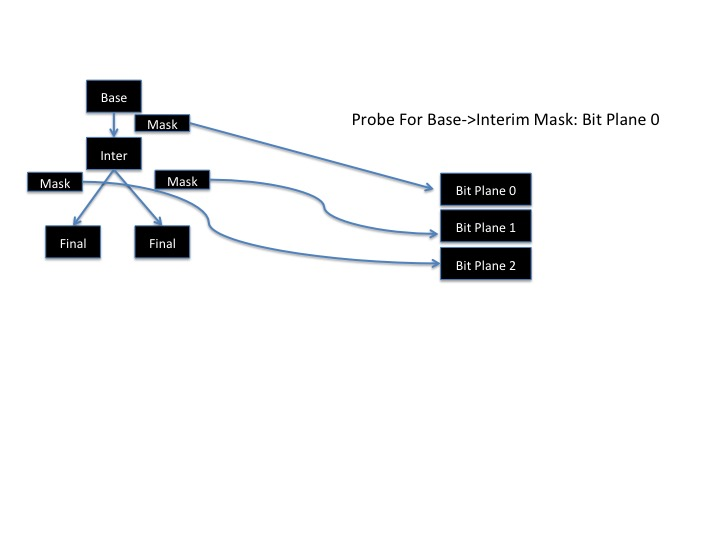
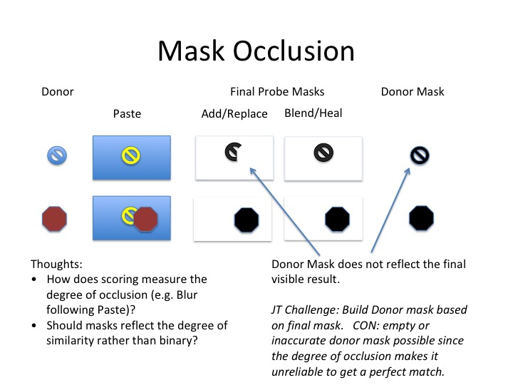

## Open and Interrogate a Journal

from maskgen.scenario\_model import ImageProjectModel, Description

### Project can be the path to the JSON file, the directory of the journal or the tgz (tarred zip file) of the journal

scModel = maskgen.scenario\_model.ImageProjectModel(project)

### Obtain list of final node IDs

scModel. finalNodes()

### Find base node for given node id

scModel.getBaseNode(node)

### Get the name of the project

scModel.getName()

### Get the list of based node ids (typical only one)

scModel.baseNodes()

### Get successor node ids to node

scModel.getGraph().successors(nodeid)

### Get predecessor node ids to node

scModel.getGraph().predecessor(nodeid)

### Returns the Description object describing the link

description = scModel. getModificationForEdge(start,end)

### Obtain all descriptions for all links

scModel.getDescriptions()

Description is:

- operationName = None
- additionalInfo = description
- inputMaskName = filename of inputmask
- maskSet = list of mask items
- recordMaskInComposite = Record the link in the probe. Uses \'no\'
  and \'yes\' to mirror JSON
- arguments = dictionary arguments used by the operation
- software = software name
- automated = \'no\'
- errors = list of mask generation error text
- generateMask = as set in the operation
- username = user's name as recorded by the tool
- ctime = time
- start = start node id
- end = end node id
- semanticGroups = list of group names

Video Mask Set consists of a list of dictionaries, each describing a
single segment. See Compare Parameters.

## Create Probes

A probe is a single edge mask representing a single manipulation realigned to a final media spatial and temporally (as in audio and video).

In other words, the probe is an association between a base image, a final image, and edge in the project graph describing the manipulation.

##CSV FILE

Create CSV file for all the probes and target probe files.

```
from maskgen.services.probes import archive_probes

archive_probes(
'project_directory/project_json_file.json',  # the project JSON file
directory='.', # the place to put the CSV file
archive=True,  # ARCHIVE in masks in tgz
reproduceMask= True) # Rebuild Masks
```

##Generate with API

```
from maskgen.services.probes import ProbeGenerator, ProbeSetBuilder
from maskgen.mask_rules import Jpeg2000CompositeBuilder, ColorCompositeBuilder

#Initialize Processors
probe_set_builder = ProbeSetBuilder(scModel, compositeBuilders=[Jpeg2000CompositeBuilder, ColorCompositeBuilder])
#Generate Probes
generator = ProbeGenerator(scModel, processors=[probe_set_builder])
probes = generator()
```

### ProbeSetBuilder Arguments

* inclusionFunction - a function that determines if an edge can be included as a probe edge.   There are quite a few pre-build options:

  * maskgen.mask_rules.isEdgeComposite - blue links
  * maskgen.mask_rules.isEdgeLocalized - blue links or any operation excluding empty masks, antiforensics, format change (Output category) or temporal altering operations.  Most global transforms are excluded as well include affine, warp, crop and resize.

  The signature is *def isEdgeComposite(edge_id, edge, operation)*.  

  * edge_id = (source node id , target node id)
  * edge = dictionary of edge
  * operation = maskgen.software_loader.Operation

* saveTargets - save the target masks to files

* compositeBuilders - the consolidation of masks aligned to final images

* graph - alternate maskgen.image_graph.ImageGraph than the one managed by the ImageProjectModel.  Often a similar graph with some adjustments.

* keepFailures - Keep all probes regardless of failure, recording the failure status in the probe if possible

* constructDonors - include donors in probes

* exclusions - dictionary of key-boolean value exclusion rules.  These rules apply to specific subtypes of meta-data such as inputmasks for paste sampled or neighbor masks for seam carving.  Exclusion starts with the scope and then the paramater such as seam_carving.vertical or global.inputmaskname.  Known exclusions:

  * global.videodonors - video donor calculation
  * global.inputmaskname - input masks, those masks that provide input selection for donors
  * global.donors - all donors

* checkEmptyMask - verify empty masks is legimate through obfuscation of other operations or directed by a record of allowed mask obfuscation as recorded in the obfuscating edge.

* audioToVideo - create a 'video-associate' media type segment for all audio segments aligned to video segments.

* notifier - notify progress (TBD)

### Type of Composite Builders

The set of builders are available in maskgen.mask_rules

* ColorCompositeBuilder -- uses each edge's assigned color to overlay in a single mask per final image
* JPEG2000CompositeBuilder -- store each probe in a JPEG2000 file as a bit plane.

ColorCompositeBuilder make looking appealing but introduces obfuscation of masks, as one region of color covers another.

JPEG2000CompositeBuilder builds one JP2 file per unique dimensions of final images within a project.   For example, if all the final images shared the same width and heighth,  the probes share the same JPEG2000 file.  Each probe is assigned a bit plane.  As an edge may be be represented by multiple probes, two or more probes for the same edge may share the same bit plane IF the probes final image mask are the same.

A JPEG 2000 image is made up of multiple channels (third dimension).  Each pixel of every channel is described by an unsigned byte, with values from 0 to 255.  Each bit in the byte is part bit plane, covering the same bit across the entire set of pixels represented in the JPEG 2000 image.

Each probe has a dictionary attribute called composites.  The key of the dictionary is the composite type: 'color' or 'jp2'.  The contents are dictionaries describing the probes participation in the composite.  This includes color, filename, bit plane, etc.   The bit plane is a number from 1 to N.   Common rules apply to find the actual channel and bit in the file:

* selected byte/channel = floor(bit number / 8) + 1
* selected bit within byte = bit number % 8 + 1



## Bit Plane

What are Bit Planes are empty:

* An Operation is chosen in the probe that does not have a change mask (e.g. some transforms).  This does not occur often. 
* An operation mask is fully occluded based on a down stream manipulation (more on this next slide).
* Mask not generated—Older Journal requires re-compute the mask.

Occlusion is not simple.

* Depends on the order of operations of the manipulator.
* It can be reduced by changing the order of operations. 
* We cannot always dictate an order change:  May be more difficult for the manipulator to achieve their goal and the final image may vary depending on the order.




### AUDIO

The frame identifier for audio is separate from video.  Audio stands alone as it manipulations and computations are only aligned to video by time.  The manipulations happen independently with the exception of frame cutting.  

The JT probe does attempt to realign audio and video manipulations by creating a media type called 'video-associate'  It is the audio probe reaigned of video.  Naturally, there are errors as the frames times cover the audio time, rarely lining up perfectly on frame display boundaries.

```
Audio segment:              start: 3.323  end: 4.453

Video frames by PTS:        |0.000|0.020|…|3.320|3.330|3.340|…|4.440|4.450|4.460|…

Audio Alignment:                             ^                        ^

Audio aligned to frames:    start: 3.320  end: 4.450  
                            start frame: 332 end frame: 445 
                            error: 0.003
```

These added video-associate segments are be added to the segment list.  It is important that you use the media type to filter out the video segments.  One added benefit to you:  you can measure the offset of audio time to video time.  From the example above: 3.323 – 3.320 = 0.003.   The error is  included in the 'error' attribute of the segment as max difference of the two start and end variation. 