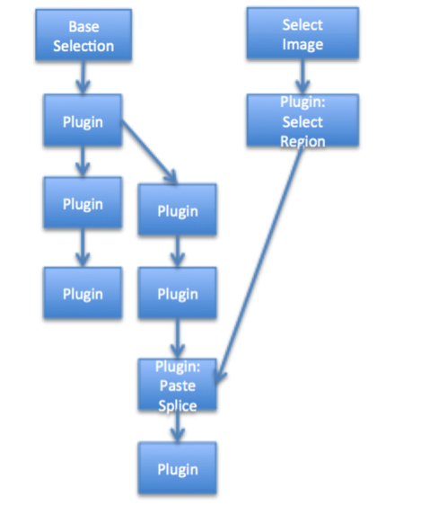
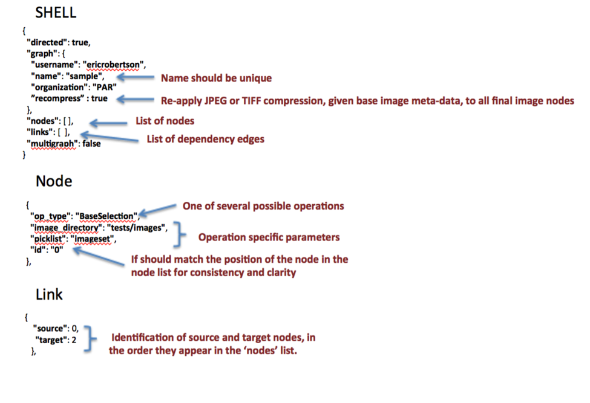
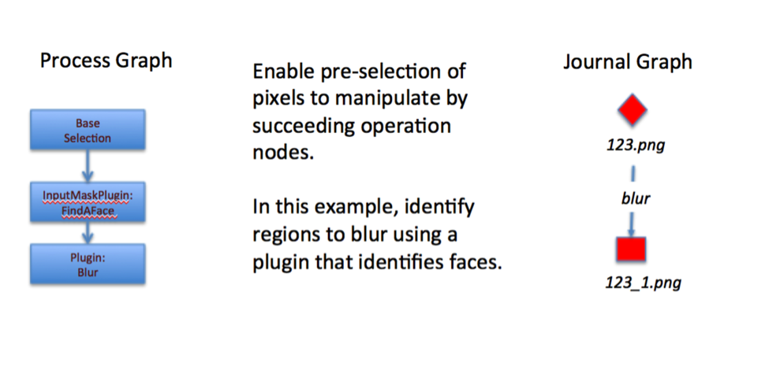
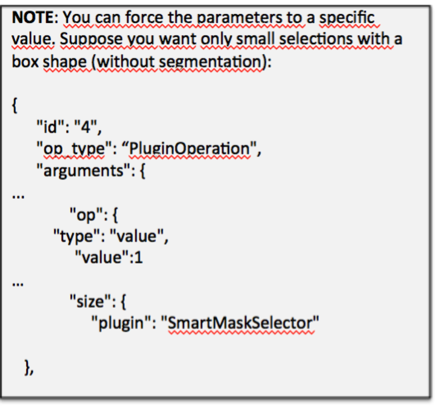
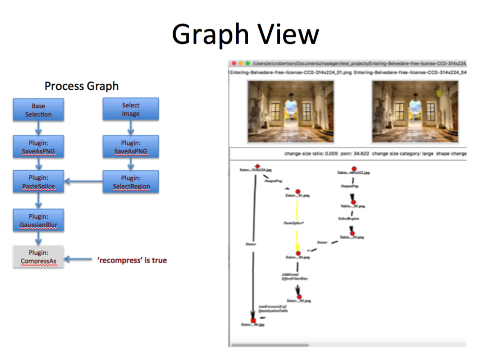

# Batch Project

Overview
========

The batch project creates projects from start to finish using plugins. A project specification describes the specific manipulations to perform. Parameters for those manipulations can be selected using randomized selectors, lists, specific values, input masks, and computed values. Groups of parameter values can be organized into permutation groups to control specific permutation of parameters across multiple projects generated on behalf of a batch project specification.

Plugins perform most of the work performed in the batch projects. A special class of plugins support preselection and analysis of data images to provide inputs into other plugins. For example, a plugin can select a mask from a from mask image presenting color-coded classified segments of an associated image. This integrates presegmented images by a machine learning algorithm to be used as part localization tasks.

### Journals and Batch Specifications

The batch project specifcation name, projecy description and technical summary are placed in the created or extended journal's graph section under key 'specifications'.

```
{
   "specifications": [ {
       "filename":"single_seam_carve.json", 
       "name": "SeamCarve",
       "description": "Create Journal with seam carving removing a select object",
       "technicalsummary" : "Small object remove from seam carving and then seams added back to restore image to original size"
      }
   ]
}
```


Command Line API
============

The journaling tool supports a batch processing. This is designed to operate on large quantities of media with the same type.

There are three types of batch features: create, extend and merge. Create and Extend features use a
batch specification providing instructions. Creation involves selecting media from a given set of directories to initiate the creation of journals. Extension involves selection of media nodes in existing journals to extend. Each extension point follows the same instructions in the batch specification.

The batch component also supports 'export'.

At its core, the batch tool requires a directory of source media for creating projects or a directory of project directories for extending projects. It can be run with the following:

jtbatch <create|extend|export|merge> <args>

### jtbatch create help

~~~
jtbatch create [-h] --specification SPECIFICATION [--count COUNT]
[--threads THREADS] [--workdir WORKDIR] --projects PROJECTS [--loglevel LOGLEVEL] [--graph]
[--global_variables GLOBAL_VARIABLES] [--initializers INITIALIZERS] [--from_state FROM_STATE] `[--export EXPORT] [--keep_failed] [--stop_on_error] [--test] [--passthrus PASSTHRUS] [--redactions REDACTIONS] [--skipValidation]
~~~


### jtbatch extend help

 ~~~
jtbatch  extend [-h] [--projects PROJECTS] [--extensionRules EXTENSIONRULES]
[--specification SPECIFICATION] [--completeFile COMPLETEFILE]
[--username USERNAME] [--organization ORGANIZATION] [--s3 S3]
[--graph] [--threads THREADS] [--loglevel LOGLEVEL]
[--global_variables GLOBAL_VARIABLES] [--initializers INITIALIZERS] [--test] [--passthrus PASSTHRUS] [--skipValidation]
 ~~~

### jtbatch merge help

~~~
jtmerge merge [-h] [--projects PROJECTS] [--output OUTPUT_DIRECTORY]
[--pairs PAIRING_FILE] [--completeFile COMPLETEFILE]
[--threads THREADS] [--loglevel LOGLEVEL]
[--workdir WORKING_DIRECTORY]
~~~

### jtbatch export help

~~~
jtexport export [-h] [--projects PROJECTS] [--completeFile COMPLETEFILE]
[--username USERNAME] [--organization ORGANIZATION] [--s3 S3]
[--updatename] [--ignore] [--threads THREADS] [--loglevel LOGLEVEL]
[--skipValidation] [--redacted REDACTIONS]
~~~


## Arguments

-   completeFile -- a file that tracks every project. If the process were to fail, the process can be restarted where it left off. Also can be used to reconcile projects that did not complete.  The file can be fed into the 'projects' argument to allow chaining of batch commands
-   projects -- a directory (and subdirectories) containing a journal projects **or** a file name of a text file where each line of the file is the path name to a project JSON to be completed.  In this second case, the input usually a completeFile from a prior executed batch command.
-   graph -- output the PNG graph image of the specification
-   threads -- simultaneous projects in progress
-   loglevel -- 10 is debug
-   global\_variables -- comma separated name/pair of global variables (e.g. x=1,y=2)
-   initializers -- qualified function names to invoke. The functions are provide the global state after global variables are set in the form of a dictionary
-   specification -- batch specification file name
-   extensionRules -- comma separated rules determining nodes to extend. See next section
-   username -- override user's environment name (from .maskgen2 file).
-   passthrus -- a list of plugin names not executed. The result of the plugin is target = source as if the plugin was just a copy command.
-   test -- do not run plugins, just log and treat as passthrus
-   redactions -- a comma separated list of argument names associated with links in the journal that reference filenames. This applied during export, removing plugin output files that should not accompany the exported journal.
-   export -- used for batch creation, export each journal upon completion with provided the s3 url referencing the buket and folder.
-   workdir -- location of project creation state including logs, completion file, permutation files, etc.
-   keep\_failed -- used for batch creation, projects that fail are removed. The option to keep allows the user to diagnose the failure.
-   count -- used for batch creation, limiting the count of projects created
-   skipValidation -- validation occurs upon creating, extending or exporting a journal.  This feature may be skipped.
-   ignore -- ignore errors even when validation fails.
-   updatename -- update the validator/QA name to the export user.
-   pairing_file -- a csv file with a main project name JSON in the first column and the path of the JSON of the second column to be merged to a project listed in the first column.  It is expected that a project in the first column does not appear in the second column.  A project in the first column may appear in multiple rows, each with a different second column value.

## Merge

Journals maybe merged together by nodes with the same MD5 of a node's file or via a pairing file.  A base set of projects are augmented by merging in those journals with nodes referencing the same file. 

Merge identifies projects to merge using one of two mechanisms.  

The first mechanism searches a group of directories or list of project JSON files as provided by the *projects* command line argument, merging projects with the same base media file (MD5).  One of the projects is chosen to be updated or a new project is created and placed in a new directory determined by the *output* command line argument.

The second mechanism is a pairing file.  The two column file links projects in the second column into the first.  The base projects to be merged into are provided by the  *projects* command line argument.  

Extension
---------

Select journals may be extended in accordance to the provided specification. Extension rules provide a guide to select the project nodes to extend in each journal under the projects directory. The specification starts with a 'NodeAttachment' operation type indicating the starting point of the specification. Select project nodes are extended by the NodeAttachment point through the batch project's specification dependency tree.

By default, extensions occur on **all** nodes not along a donor path, not a final node, the result of an format change, or the result of an antiforensic . The extension rules are as follows:

- +\<category:opname\> \-- incude extending nodes created by operations of the name or category: Examples include +Output: and +Output:OutputPNG

- +$\<category:opname\> \-- incude extending nodes that source operations of the name or category: Examples include +\$Output: and +\$Output:OutputPNG

- donorpath -- include in the nodes to extend those nodes along a donor path

- final -- include in the nodes to extend those final nodes

- outputop -- include in the nodes to extend those nodes created by a format change (each operation category Output).

- antiforensicop -- include in the nodes to extend those nodes created by an antiforenic operation

- outputsourceop -- include the node if node is the source prior to an output operation

- antiforensicsourceop -- include the node if node is the source prior to an antiforensic operation

- \~\<category:opname\> \-- exclude extending nodes with operations of the name or category. Examples include \~Output: and ~Output:OutputPNG

    To override the default inclusion, add the rule '\~:'

    Some examples:

    - Include only those operations prior to antiforensics: antiforensicsourceop,\~:
    - Include nodes produce by PasteSplice only: Paste:PasteSplice,\~:

Example Command Line:

```
jtbatch extend --projects projects_directory --specification myspec.json --extensionRules "~Output:" --completeFile extenstions.txt
```

## Chaining

Often batch components work together.  For example, projects are created, then extended, merged and then exported.   The complete file from one batch process can be fed into the next batch process via the *projects* input argument.

Example:

~~~
jtbatch  export --projects extensions.txt --s3 s3://someplace --completeFile exports.txt

jtbatch extend --projects <DIR> --specfication spec.json --extensionRules "~Output:"
~~~
SPECIFICATION
=============

A specification is a dependency graph that mirrors (with some exceptions) the structure of the final projects.



> *Figure Example Specification Layout*

Each node in the graph is an operation. Each link is a dependency. A node operation is not executed until its dependency nodes have been executed. Each operation is parameterized in the specification to direct the operation's execution. 

### Operation Nodes

**Select Image**: Provided a pool (directory) of images

**Base Selection**: Same as Select Image, except start new project using the selected image name.

**Plugin**: Execute a plugin operation to create a new manipulated image. *Requires consistent parameters.*

**Input Mask Plugin:** Execute a plugin on a image to produce an (input) mask and any additional name/value pairs to be used to as parameters in subsequent operations. Input masks highlight groups of pixels (full intensity) as constraints to other plugins.

**Node Attachment:** Used with JT Batch Process to extending existing project, this operation node represents the starting point of the specification, taking the place of a Base Selection node. The attachment point is a node in an existing project being extend.

**Image Selection Plugin:** In some cases, the donor image is selected by a plugin rather than the pooling technique support by Select Image nodes. For example, donor images may be preselected for given base selections. Thus, for each base selected image, a plugin can lookup a suitable donor selection.

Overall File Structure
----------------------

The specification is a JSON file using networkx format. The file is broken up into three sections, encased a shell. The graph section contains overall properties for the resulting projects, the node section lists all the operation nodes and the links section forms the dependencies between the nodes.



### Link Source and Target Identifiers

According to the NetworkX specification, link source and target identifies the node based on the order it appears in the node section. Thus, the recommendation is to use node IDs reflecting their order of
appearance. The batch project specification permits link source and target identifiers to be the string identifier for a node. The python function maskgen.batch.batch\_project.remap\_links consumes a dictionary of a NetworkX graph, returning a new dictionary with the source and target mapped to their numerical ordinal. This allows for a more direct representation in the links section without the order dependency.

~~~
{
  "source" : "base selection",
  "target" : "output PNG for base"
}
~~~
### Graph Section

The start of the specification is usually a graph section. This is includes properties the "projectdescription", "technicaldescription" and "username". In this section there are two optional arguments that are available. These are "recompress" or "rename". These are tags assigned true or false in the specification and will run certain commands after all nodes have been executed. The recompress flag will run the "CompressAs" plugin on all image final nodes using the base as the donor. The rename flag is true by default but if turned off the end nodes of the project will not be renamed once completed.

Dependencies and Donors
-----------------------

At this time, JT permits only one donor per operation. However, several operation results can contribute to parameters of subsequent operations. Dependencies inherent in the graph structure represent both the donor dependency and the order of execution, insuring that results from prior manipulations can feed parameters of subsequent manipulations.

Donor links are marked with an additional attribute *'donor': true*. Alternatively, a donor parameter can specify the 'source' of the donor. In absence of both, a donor link will not be created and donor parameters will fail to resolve.

Operations
----------

**BaseSelection**

Select an image from a pool of images maintained in a directory. [The directory should only contain images for selection.]{.underline} The base selection provides a single image used to start a new project. The selected image provides the name of the project. The image is expected to serve as a (the) base image for the project that is to be manipulated. There must be one and only one BaseSelection node; it must not have any predecessor nodes.

Parameters:

-   **\"image\_directory"** - a directory of a pool of images to select from (randomly). The directory should ONLY contain images. If directory contains more than image files, then either add the files to NOT select in the picklist file OR set the *filestypes* parameter.

-   **"filetypes"** - optional list of file suffixes to search in the image directory (e.g.\['jpg','tiff'\])

-   **\"picklist\"** - an in memory structure tracking the names of image files already picked from projects to prevent future selection. A file is created with the same name in the 'working directory', retaining the pick list selection across multiple independent and sequential batch runs. In absence, the file with the same node as the node identifier is used to maintain the picklist, thus forcing the picklist to be unique to a single node.

-   **"permutegroup"** - those parameters sharing the same permutegroup are organized into a group to form permutations of all possible parameter values. Thus, a single image can be used to produce multiple projects, each with variations to the results of the plugins in response to the different parameters provided.

-   **'timestamp name' -** optional true or false parameter. If present
    and true, the name of each project has a time stamped suffix.
    Timestamps are also used if the project already exists, as
    overwrites is not permitted.

**ImageSelection**

Select an image from a pool of images maintained in a directory. Like BaseSelection, an ImageSelection node most not have any predecessor nodes. Unlike BaseSelection, multiple ImageSelection nodes are permitted.

Parameters:

> The parameters are the same as the BaseSelection. The image directory
> and picklist can use the same pool as other ImageSelection and
> BaseSelection nodes.
>
> ImageSelection can also randomly pick from a list of files without a
> picklist using the 'files' parameter:

-   **"files" -**list of file names. Part of the file names (e.g. base path) can be parameterized to pull from global variables.

**PluginOperation**

Invoke a plugin, producing a manipulated target image given a source image. The source image is assumed to come from a direct dependent operation node. The plugin operation is invoked for each dependent node that is either ImageSelection, BaseSelection or PluginOperation. The source image from each dependent node is operated upon by the plugin producing a target image, associated target node in the resulting journal project and a link between the source and target nodes in the journal project.

Parameters:

-   **"plugin" -** identifies the the name of the plugin.
-   **"experiment_id"** - an identifier recorded within links created by this plugin.
-   **"description"** - set the description of the for created links.
-   **"semanticGroup"** - a list of semantic groups name to be associated with created links.
-   **"arguments" -** the set of arguments to be provided to the plugin. Each argument as a type and supporting descriptions. *Arguments fill **both** the requirements of the plugin and the requirements of the operation definition*.

**InputMaskPluginOperation**

Invoke a plugin, producing an input mask and any additional name/value pairs based on the source image. The input mask and name/value airs can be used as parameters to other dependent plugins. These type of plugins are called 'selectors'.  Th image is not added to the project via a node.

Parameters:

-   **"plugin" -** the name of the plugin
-   **"arguments" -** the set of arguments to be provided to the plugin. Each argument as a type and supporting descriptions. [Arguments fill **both** the requirements of the plugin and the requirements of the operation definition]{.underline}.
-   **"usebaseimage"** - provide the base image to the plugin rather than the last image produced within the dependency graph. Thus, takes the last dependent node and traces up the tree to the base image.
-   **"prnu"** - records if the image is a PRNU.

**InputSelectionPluginOperation**

Invoke a plugin, selecting output file name for a provided image. The plugin MUST return, as one its key/values in the result, a key of 'file' with a value of the full path name of an image to be added to the project. For example: {'file':'/mnt/data/img123.jpg'}. The plugin operation must dependent directly or indirectly to a BaseSelection or NodeAttachment node. These type of plugins are called 'selectors'.

Parameters:

-   **"plugin" -** the name of the plugin
-   **"arguments" -** the set of arguments to be provided to the plugin. Each argument as a type and supporting descriptions. *Arguments fill **both** the requirements of the plugin and the requirements of the operation definition*.
-   **"usebaseimage"** - provide the base image to the plugin rather than the last image produced within the dependency graph. Thus, takes the last dependent node and traces up the tree to the base image.

**NodeAttachment**

Represents the attachment point to a node in the existing project. It serves in lieu of a BaseSelection operation, injected a node from an existing project as the source node of the specification. NOTE: a
project may be extended by more than one node, thus NodeAttachment will represent, one at a time, each attachment point.

Parameters: NONE

**PreProcessedMediaOperation**

Batch processing by the JT using the 'JT process' tool requires an external tool performing manipulations to a group of media in batch. The sources of the manipulation are collected from one directory; the target of each manipulation is placed in a different directory. The target file name is the same name as the source, except for a possible change in the suffix (e.g. png, mov, etc.). Thus, two directories exist, one containing the source media and one containing the target media. The JT batch process collects the location of the two directories and the manipulation operation information, it augments or produces a separate journal for each source/target pair, matched by their shared name.

This functionality is extended into project via the PreProcessedMediaOperation node. Given a target directory of media files with same prefix name as the journal (based on the initial image), the node selects the media file with the matching name, loads that image and creates a link to the prior operation node's node in each created journal.

Arguments are collected from a CSV file collocated with the media image files in the target directory. The CSV file is organized as a comma separated file of image file name followed by additional argument values. The names for those arguments are provided as part of the PreProcessedMediaOperation parameters.

Parameters:

-   **"directory" -** target directory of media
-   **"argument file" -** name of CSV containing argument values associated with the operation.
-   **"argument names" -** a list of argument names associated with columns 2 through N of the argument file. Column 1 is the media file name.
-   **"op" -** the JT operation name
-   **"software" -** the software used to create the target files
-   **"software version" -** the version of the software used to create the target files
-   **"description"** - the description of the software operation
-   **"usebaseimage"** - provide the base image name to the selector rather than the last image produced within the dependency graph. Thus, takes the last dependent node and traces up the tree to the base image.
-   **"experiment_id"** - an identifier recorded within links created by this plugin.

#### Example Description:

~~~
{
  "op_type": "PreProcessedMediaOperation",
  "argument file": "arguments.csv",
  "argument names": ["Image Rotated","Bits per Channel"],
  "directory":"results",
  "op": "OutputPng",
  "category": "Output",
  "software": "opencv",
  "software version": "3.3.0",
  "description":"output png",
  "id": "1"
}
~~~

#### Example CSV:

~~~
image.png,yes,16
~~~
Plugin Review
-------------

-   Plugins are operations.

-   Plugins are provided, as inputs:

    -   Filename of source image

    -   Filename of target image

    -   Additional arguments

-   Plugins action:

    -   Overwrite target image

    -   Optionally return name/value pairs that may be used as to set parameters of subsequent plugins.

An input mask plugin pre-selects a group of pixels of a source image for alteration but subsequent operations.

Arguments
---------

Arguments for plugins pool from mandatory and optional arguments from the operation definition associated with the plugin AND the list of arguments defined for the specific plugin. In some case, there is overlap. The plugin has the option of returning arguments to set mandatory and optional parameters not provided to the plugin upon execution---the first component of the returned tuple is dictionary of name-value pairs, which are interpreted as arguments to the JT.

In some case, mandatory and optional arguments are fixed to a specific value for a specific plugin. For example, GaussianBlur is a Blur type operation with the blur type set to 'Gaussian'. In this case, the argument for blur type is set to the **value** argument type as defined in the next section.

~~~
"arguments": {
    "x" : {
      "permutegroup" : "example_group",
      "type" : "int[1:4]",
    },
    "y" : {
      "permutegroup" : " example_group ",
      "type" : "list",
      "values": [1,2,3]
    }
  }
}
~~~
Argument Types
--------------

Each argument is a mapping between the argument name and a dictionary of properties describing how to set the argument for each project. Each group of properties includes one mandatory property called 'type'. The type directs the batch argument selector to the appropriate function to set the argument value.

-   **value=** set a parameter to a specific value**.** The type of the value should match expected type for the associated parameterd by the plugin.

~~~
{
  "type" : "value",
  "value" :"yes"
}
~~~
> **NOTE**: A short hand for type ***value***, is to simply set the
> value:
>
> \"subject\" :\"person\"

-   **imagefile =** select an image produced by another node. The image's source node is identifier using it's node id.

~~~
{
  "type" : "imagefile",
  "value" :"source node id"
}
~~~
- **global** = select value from the global state space (see 3.10)

~~~
{
    "type" : "global",
    "name" :"coo"
}   
~~~
- **mask** = select an image mask produced by another node. Changemasks are specific to an edge: a source and target node pair. An edge is identified by source and target node ids. The mask is used by some plugins to identify regions within the source image to manipulate. By default, change masks use high values to represent unchanged pixels. Use the 'invert' option to use high values for changed pixels.  

> **Invert:** For mask, the JT produces masks where black pixels are manipulated.  Typically, input masks use white pixels to indicate pixels to apply the manipulation, although this depends on the plugin\'s input requirements.  When using an JT produced mask (from an edge), the pixels are inverted to match the input requirements of plugin.
>
> ~~~
>   {
>     "type" : “mask",
>     "invert" : True,
>     "source" :"source node id"
>   }
> 
> ~~~

- **donor=** select the resulting image from any predecessor node. 'source' is optional. In its absence, one of the direct decendant nodes is chosen.

    ~~~
    {
      "type" : ”donor",
      “source”:”source node id”
    }
    ~~~

-   **list=**randomly pick from a set of values

~~~
{
  "type" : ”list",
  "values" :[”other”, “landscape”]
}

~~~


-   **variable =** select an output name/value pair from a predecessor plugin node. The source node is provided using it's node id. The pair's value is identified by the name.

~~~
{
    "type" : “variable",
	“name" : “box_altered“,
    "source" :"source node id"
}
~~~

-   **input=** identifies the name of input image file (input mask) from the output (target) image of another plugin**.** The source node is provided using it's node id.

> ~~~
> {
>     "type" : “input",
>     “source" :“source node id“
>  }
> ~~~

-   **plugin=**call a plugin function registered through the Python setuptool's entry point *maskgen\_specs*. The function name is the entry point name. The function accepts a dictionary of parameters, provided in the definition.

~~~
{
  "type" : ”plugin”,
  “name" : “kernel_builder“,
  ”parameters" : { “kernel_size”: 5}
}
~~~


- **int\[low:high\]=**select a value, uniform distribution over the
    range, inclusive**.**

    ~~~
    {
       "type" : ”int[1:100]”
    }
    ~~~

    

-   **float\[low:high\]=** select a value, gaussian distribution over
    the range, inclusive

~~~
{  
  "type" : ”float[1:100]”
}
~~~

-   **yesyno=select yes or no**

~~~
{  
  "type" : ”yesno”
}
~~~


### Substitutions and Variables

Substitutions are selected values from the local and global state space. They are formatted into strings using a variation of pythons string formatter https://docs.python.org/2/library/string.html.

Substitutions are applied to:

-   argument type *plugin's* parameter values

~~~
{ 
  "type" : ”plugin”,
	 “name" : “kernel_builder“,
  ”parameters" : { “kernel_size”: “{kernel_size”}}
}

~~~


-   argument type value

~~~
"subject" : "{project_subject}"
~~~


In the examples, project\_subject and kernel\_size are global variables. Local state variables may also be used. Local state represents the state space for each node. The node identifier in accordance to the specification determines the state space. The format is variable name
'@' node id.

~~~
 { 
  "type" : ”plugin”,
  “name" : “kernel_builder“,
  ”parameters" : { “kernel_size”: “{kernel_size@node123”}}
}

~~~


The node local state space includes arguments returned from calls to the plugins (either **PluginOperation**, **InputMaskPluginOperation ,
 InputSelectionPluginOperation)** including the 'output' file name. This feature is nearly equivalent to using the 'variable' specification type, except this approach uses a string formatter vs. fetching the raw value from a local state.

Results of the substitutions strings. Type conversions can be applied using the post processing 'function' in the argument specification:

~~~
{
   'type':'value',
   'value':'{foo}',
   'function':'numpy.int'
}
~~~


The formatter can process nested dictionaries.

~~~
{
   'type':'value',
   'value': {‘name’: '{foo}', ‘location’: ‘{dir}’}
}
~~~


Using the InputMaskPlugin
-------------------------

The InputMaskPlugin enables pre-selection of pixels and parameters give an image. The resulting masks and parameters are available to direct or indirect child plugin operations with the specification. This enables consistent processing across multiple plugins that coordinate in a complete manipulation.



*Figure InputMaskPlugin Process Specification*

Critical Plugins
----------------

### Select Region

Selecting a region of an image is effectively setting the alpha channel of an RGBA image, adding the alpha channel if necessary, such that selected pixels are 255 and unselected pixels are 0. SelectRegion is used prior to donation for operations such as Paste Splice.

There are three plugins that support Select region.

1.  SelectRegion -- The plugin uses Felzenszwalb  to segment the image.
    A single connected set of pixels are selected. The plugin returns
    'paste\_x' and 'paste\_y' parameters selecting a suitable region
    within the selected image for use in paste clone type operations.
    SelectRegion can also be used to create a selection mask by setting
    the input parameter 'alpha' to 'no'

2.  SmartMaskSelector -- The plugin uses SLIC to segment the image. The
    plugin accepts several size constraining parameters to tune the
    selection process. As with SelectRegion, SmartMaskSelector can also
    be used to create a selection mask by setting the input parameter
    'alpha' to 'no'. Unlike SelectRegion, the default alpha value is
    'no'. Furthermore, SmartMaskSelector also returns paste\_x and
    paste\_y parameters.

3.  SelectionRegionWithMask -- The plugin uses a previously selected or
    modified region, as indicated by an inputmask, to select the region.

~~~
{
  "id": "4",
  "op_type": "PluginOperation",
  "arguments": {
    "mediumh": {
      "type": "int[64:128]"
    },
    "smallw": {
      "type": "int[32:64]"
    },
    "largew": {
      "type": "int[128:512]"
    },
    "largeh": {
      "type": "int[128:512]"
    },
    "op": {
      "type": "list",
      "values" : ["box","slic"]
    },
    "smallh": {
      "type": "int[32:64]"
    },
    "size": {
      "type": "int[1:3]"
    },
    "mediumw": {
      "type": "int[64:128]"
    },
    "alpha": {
      "type": "value",
      "value": "yes"
    }
  },
  "plugin": "SmartMaskSelector"
}
~~~




### Paste Splice

There are a number of plugins available to aid in Paste Splice. The example project specification tests/batch\_process.json under maskgen contains an example paste splice configuration.

In the example, the SelectRegion plugin uses Felzenszwalb to segment the source image to find a spliced object.

By default. the PasteSplice plugin places a selected image on a random selected area in the target image with rescale or rotation. This approach is called 'simple'. A 'random' approach includes random resizing and rotation. PasteSplice also supports a complex placement solution using either SLIC (segment value of 'slic) or Felzenszwalb (segment value of 'felzenszwalb') to select a placement region of some uniformity (texture).  It includes rescale and rotation, as needed, to fit the pasted object into the selected placement region.  Naturally, this approach is slower. This option is turned on by setting 'approach' to 'texture' on the PasteSplice plugin (show below).

~~~
{
  "op_type": "PluginOperation",
  "plugin": "PasteSplice",
  "id": "5",
  "arguments": {
    "approach": {
       "type":"value",
       "value": "texture"
     },
    "segment": {
       "type":"value",
       "value": "slic"
     },
     "donor" : {
       "type": "donor"
     }
  }
}
~~~


The PasteSplice plugin returns the 'transform\_matrix' parameter recording the transformation applied to the donor image. The matrix is a 3x3 transform matrix.

### Pre Segmented Images

Another option for selecting a region of an image is the PreSegmentedSelectionRegion plugin.    The plugin is designed to be used with a custom segmentation algorithm, like a deep learning approach. The intent is to have a set of images pre segmented, each with an associated RGB mask image that color-codes the regions of the segmented images.  

The plugin mask expects the pre-segmentation algorithm to create output image masks with the same name as the image (suffix with .png), placed in a separate directory.   Within that same directory, a classification.csv file contains the mappings of color to subject descriptor, in accordance the SelectRegion plugin categorization, those classifications include "people\",\"face\",\"natural object\",\"man-made object\",\"large man-made object\",\"landscape\", and "other".

The arguments to the plugin include the segmented mask directory (segmentation\_directory) and the color to use (color). The color is optional. In its absence, one will be chosen at random given the available classification colors in the chosen image. If a color appears in more than one connected component within the mask image, only one region of connected component is selected.

The color identified in the classifications.csv is the RGB color. Here is an example:

~~~
"[200,100,200]", natural object
~~~

### Design Paste Clone

The DesignPasteClone plugin supports paste sampled cloning. It requires in an input mask of the indicated the pixels to be cloned and a location (upper right corner) to paste the cloned region. The plugin requires a preselected input mask, paste\_x and paste\_x location parameters. The plugin is often provided these parameters by forming a dependency on either the SelectionRegion (alpha = 'no') or SmartMaskSelector plugins (alpha = 'no') configured as InputMaskPluginOperations.

~~~
"id": "DesignPasteClone1",
                 "op_type": "PluginOperation",
     "arguments": {
        "inputmaskname": {
          "source": "CloneMaskSelect",
          "type": "input",
          "description": "localized selector"
        },
        "paste_y": {
          "source": "CloneMaskSelect",
          "type": "variable",
          "name": "paste_y",
          "description": "localized  y position paste"
        },
       "paste_x": {
          "source": "CloneMaskSelect",
          "type": "variable",
          "name": "paste_x",
          "description": "localized x position paste"
        },
        "purpose": {
          "type": "value",
          "value": "clone"
        }
      },
      "experiment_id": null,
      "plugin": "DesignPasteClone"
}
~~~


Permutations
------------

Permutations are used to control the distribution of parameters for plugins across multiple projects. To permute values of a parameter with other parameters, add the parameter to the same permute group with the argument definition. In the example below, the percentage\_height is placed in a permute group called image.

~~~
{
  "op_type": "InputMaskPluginOperation",
  "plugin": "CropPermutations",
  "id": "2",
  "arguments": {
    "percentage_width" : {
      "type" : "value",
      "value" :0.2
    },
    "percentage_height" : {
      "permutegroup" : "image",
      "type" : "float[0.04:0.2:0.02]"
    }
  }
},

~~~


The order of defining the parameters with the JSON file determines the
order the parameters are adjusted across each project. Consider two
parameters (x and y) in the same permute group:

~~~
"arguments": {
    "x" : {
       "permutegroup" : "example_group",
       "type" : "int[1:4]",
    },
    "y" : {
      "permutegroup" : " example_group ",
      "type" : "list",
      "values": [1,2,3]
    }
  }
},

~~~


Given these parameters generated across 13 projects will have the
following values.

-   x=1,y=1

-   x=1,y=2

-   x=1,y=3

-   x=2,y=1

-   x=2,y=2

-   ...

-   x=4,y=3

-   x=1,y=1

The parameters will reset back to the start as needed.

Normally, images cannot be reused across projects. However, it may be useful to generate different permutations over the same image. To support this type of experiment, image selection can be added to a permutation group. It is important to add the image selection at the top of the definitions since the reuse rule still applies. The permutation group prevents the selection of a new image until other parameters in the permutation group have been exhausted.

~~~
{
  "op_type": "BaseSelection",
  "permutegroup": "image",
  "image_directory": "tests/images",
  "picklist": "imageset",
  "id": "0"
}
~~~


The image selection does **not** reset. Once an image and its associated permutation are exhausted, the image is removed from use in subsequent iterations.

### Saving State

The state of all parameters that iterate as part of a permutation group is preserved in a separate files under the working directory. Each parameter has its own state file containing the last known value. Image selection state files contain all images used thus far. The files are named using the node identification with the exception of Image selectors, which use the pick list name.

State saving helps recover where batch project left off in the case of a process failure.

***KEEP YOUR WORKING DIRECTORY SEPARATE FROM ALL OTHER DIRECTORIES. IT IS NOT AN IMAGE POOL DIRECTORY.***

 Custom Initializers
--------------------

In some cases, global inititalizers may be needed to fulfill custom plugins. The command allows for a few items to be injected into the batch projects global state space. First, key-value pairs can be made available to the global state space. Second, custom functions may be invoked at start up to initialize packages and add additional key-values to the global state space. The custom function accepts the global state dictionary and returns dictionary with additional key-values to ihect into the gobal state space. The dictionary provided to the initializing function is preo-populated with the command line provided key-value pairs.

An example function:

~~~
def loadLooup(global_state):
   with open(global_state['lookupfile.location') as fp:
     return { 'index' : loadIndexFromFile(fp))
~~~

Command line parameters example:

~~~
 --global_variables lookupfile.location='/tmp/lookup.csv --initializers index_package.loadLookup
~~~

### COCO

MSCOCO (<http://cocodataset.org/#home>) is a dataset for large-scale object segmentation. Images provided as training sets and the results are recorded in an JSON formatted annotation schema. The schema describes each image, each category used for the images and the annotations describing the regions identify items within the images. An Python API has ben developed for ease use with the JSON formatted file.

COCO provides batch project the ability to generate masks based on the pre-segmented images to be used for spatial localized operations like blur, paste splice and paste sampled.

COCO extensions exist in a separate subproject (called maskgen\_colo) under maskgen with other\_plugins/CocoMaskSelector. The project should be installed separately as show below. Once installed, the batch project may be used with COCO. First, an initializer is used to initialize the COCO indices. Second, the CocoMaskSelector plugin can be copied to the appropriate plugin directory.

~~~
cd other_plugins/CocoMaskSelector

python setup.pt sdist

pip install --e .

mkdir ../../plugins/CocoMaskSelector

cp __init__.py ../../plugins/CocoMaskSelector
~~~

Once installed, the batch project can initialize the COCO system with a custom initializer and the location of the annotations file for each of the COCO images being used in the project.

~~~
--global_variables coco.annotations=tests/other_plugins/CocoMaskSelector/annotations.json --initializers maskgen_coco.createBatchProjectGlobalState
~~~

The CocoMaskSelector is used with an InputMaskPlugin node to preselect the mask. The image selected can be either BaseSelection or ImageSelection type operation node, as long as the file name appears within the provide annotations file. Thus, the CocoMaskSelector is direct dependent of either an BaseSelection or ImageSelection node.

The CocoMaskSelector requires the COCO index and COCO instance. The COCO Index is an add-on feature created during initialization that associates file name back to the COCO assigned image ID. Since these instances are constructed at system initialization, they are located in the global state space and accessed with the variable type 'global'.

The CocoMaskSelector accepts two additional arguments: area.lower.bound and area.upper.bound. These integer arguments represent the lower and upper bound of area in pixels when choosing a segment from the annotations.

~~~
{
  "op_type": "InputMaskPluginOperation",
  "id": "2",
  "arguments" : {
     "coco": {
      "type": "global",
      "name": "coco"
    },
    "coco.index": {
      "type": "global",
      "name": "coco.index"
    }
  },
  "plugin": "CocoMaskSelector",
  "experiment_id": "MFC18"
}
~~~


### Example COCO Project

See maskgen/tests/other\_plugins/CocoMaskSelector

### Pre-processing COCO Images

When using the area bounds as arguments to the CocoMaskSelector, it is recommended that images and the associated annotation file is trimmed to exclude any images that do not contain annotations meeting the given criteria. A utility function under maskgen\_coco project selects images from a directory, moving those images that meet the area constraints into another directory. If the source and target directories are the SAME, then the image is removed from the directory if does not meet the constraints. The function also accepts a max count of images to select, thus creating smaller annotation files and image subsets.

~~~
import masgen_coco
masgen_coco.moveValidImages('/Users/me/source', '/Users/me/subset_images', '/Users/me/instances_train2014.json',areaConstraint=(1024,8192),maxCount=30,
newAnnotationPath='/Users/me/subject_annotations.json')
~~~

Example
=======




*Figure Example Specification with Sample Resulting Project*

Crop Example with Permutations 
-------------------------------

### Reusing the Same Image for Multiple Projects.

Add permute group to image selection.   In this example, the group name
is called 'image'.

~~~
{
  "op_type": "BaseSelection",
  "permutegroup": "image",
  "image_directory": "tests/images",
  "picklist": "imageset",
  "id": "0"
}
~~~


### Defining Permutations for the Crop Region

One of the first steps **after** creating the PNG file is to obtain permutations over the selected image. Since the permutations of crop are based on the selected image, there needs to be a way for the permutation groups to be set based on the [result]{.underline} of a plugin.  

Parameter selector plugins (**InputMaskPluginOperation)** consume the image and produce values for parameters used by other plugins.  In this particular example, the CropPermutations plugin is used to produce the set of values to permute over for values of x and y defining the upper left crop position. The plugin consumes arguments defining the percentage width and height of a image to crop (remove).  Recall, these parameters can be permuted, set to specific values or picked randomly.  
In the example, the width to a fixed 20%, the height as added to the
'image' permute group starting at 4% and increasing to 20% by 2%
increments 

~~~
{
  "op_type": "InputMaskPluginOperation",
  "plugin": "CropPermutations",
  "id": "2",
  "arguments": {
    "percentage_width" : {
      "type" : "value",
      "value" :0.2
    },
    "percentage_height" : {
      "permutegroup" : "image",
      "type" : "float[0.04:0.2:0.02]"
    }
  }
}
~~~


The result of this plugin is the specific pixel width and height cropped provided to the plugin (crop\_width and crop\_height) and two arguments that define the list of all possible values starting positions (crop\_x and crop\_y) on 8 bit increments given the shape of the image. The crop\_x and crop\_y are parameter specifics as they would appear in a plugin argument specification

###  Using Permutations in Crop

The Crop plugin requires pixel width and height to crop in addition to a starting position (x,y).  All these values are consumed from output of the source CropPermutations (node id 2) as indicated by the type 'variable'.   Since CropPermutation is returning permute group specifications for values crop\_x and crop\_y, the crop\_x and copy\_y arguments are added to the permute group ('image\' in this example).  Now the crop\_x and crop\_y inputs to crop will iterate through the list of values provided by CropPermutations.  

At this point, the permute group 'image' consists of the image selection, percentage\_height for CropPermutations, crop\_x for Crop and crop\_y for Crop.

~~~
{
  "op_type": "PluginOperation",
  "plugin": "Crop",
  "id": "3",
   "arguments": {
    "pixel_width" : {
      "type" : "variable",
      "source":"2",
      "name" :"crop_width"
    },
    "pixel_height" : {
       "type" : "variable",
      "source":"2",
      "name" :"crop_height"
    },
     "crop_x" : {
       "permutegroup" : "image",
       "type" : "variable",
      "source":"2",
      "name" :"crop_x"
    },
     "crop_y" : {
       "permutegroup" : "image",
       "type" : "variable",
       "source":"2",
       "name" :"crop_y"
    }
  }
}
~~~

### Running this example.

Create a sample directory of images  (stay over 1000x1000), make a copy of the batch process JSON file and change the location of the **image\_directory** created directory.  Create an empty directory for the resulting projects.  Run the command:

~~~shell
% jtproject --specification permutation_batch_process.json.json --projects myresultprojectsdirectory --workdir state –graph --loglevel 0 --threads 1
~~~


Failures
--------

The batch project has several parameters to handle failures.

-   **stop\_on\_error :** halt the project if ANY project fails. By default, the project is cleaned up and then next media item is selected

-   **keep\_failed:** keep failed projects. By default, the project directories are removed

-   **from\_state**: load from a permutation state file

The picklists are updated automatically to exclude any media used in a project, regardless of success.

Every failed project's permutation state is retained in a state failure file. The file is texted formatted where each line contains a JSON structure description the state of each permutation element including media picklists. The file is named and formatted with the current date 'failure-YYYY\_MM\_DD\_HH\_mm.txt'. This is file may be used to restart failed projects exclusively, supplying the file name to the 'from\_state' command line argument. Only the contents of the file are processed.

**NOTE**: The count parameter is still used with a from\_state file. To process all the contents of the from \_state file, set the count to the number of lines in the file.

### Example Failed State File:

~~~
{"__global__": {"1": "/Users/foo/Documents/projects/ donor/08efa11b0f97a7077909daf4706b907f.jpg", "0": "/Users/foo/Documents/projects/ base/0c617f8e9fb87051eb58db304b396fe0.cr2"}}
~~~

Batch Extensions
================

Discussion
----------

Extending existing projects is a function of the batch process tool. Unlike the batch project tool discussed in this document, a batch process tool's primary function is to extend journals (in increments).

The batch process tool is documented as part of the JT documentation. To extend journals, one needs to consider (1) which node types to extend,
called attachment points, and (2) what defines the extension. A batch project specification defines the extension rules, leveraging all the capability of the batch project tool. The specification has *one* special type of node called a *NodeAttachment*. The attachment node represents the starting point of the dependency graph within the specification. It serves only as a marker indicating 'begin processing here'. Each node selected as an attachment point in an existing journal is extending as described by the specification, starting with the attachment node.

**Node selection rules**: Which image nodes should be extended?

\(1) Nodes must be on the primary path (not a donor path).

\(2) Nodes must not be base or finals

\(3) Nodes that are not the direct result of a file format transformation (e.g. JPG to PNG).

\(4) Nodes that are not the direct result of an anti-forensic

\(5) Nodes can be excluded based on operation. For example, it may be appropriate to exclude nodes that are constructed using manipulation matching a additional manipulation with the batch specification.  In other words, do not repeat a manipulation type for the same node.  

### Running an extension

Projects to be processed are placed in a single directory. The projects can be unzipped into directories OR zipped tar files (tgz). By default, selection rules 1 through 4 are active. Rule 5 is specific to operations and groups, thus it does not have exclusion.

~~~shell
jtprocess --projects <DIR> --specfication spec.json
~~~


Example Extension with NODE Attachment
--------------------------------------

The example below selects a region in an image and blurs that region.

~~~
{
  "directed": true,
  "graph": {
    "username": "ericrobertson",
    "name": "sample",
    "organization": "PAR",
    "projectDescription" : "test",
    "technicalSummary" : "Automated",
    "semanticrestaging" : "no",
    "semanticrepurposing" : "no",
    "semanticrefabrication" : "no",
    "recompress": true
  },
  "nodes": [
    {
      "op_type": "NodeAttachment",
      "id": "0"
    },
    {
      "id": "1",
      "op_type": "InputMaskPluginOperation",
      "arguments": {
        "mediumh": {
          "type": "int[64:128]"
        },
        "smallw": {
          "type": "int[32:64]"
        },
        "largew": {
          "type": "int[128:512]"
        },
        "largeh": {
          "type": "int[128:512]"
        },
        "op": {
          "type": "list",
          "values" : ["box","slic"]
        },
        "smallh": {
          "type": "int[32:64]"
        },
        "size": {
          "type": "int[1:3]"
        },
        "mediumw": {
          "type": "int[64:128]"
        },
        "alpha": {
          "type": "value",
          "value": "yes"
        }
      },
      "plugin": "SmartMaskSelector"
    },
    {
      "op_type": "PluginOperation",
      "plugin": "GaussianLocalBlur",
      "id": "2",
      "arguments": {
        "inputmaskname" : {
          "type" : "input",
          "source" :"1"

        },
        "invertmask": {
          "type":"value",
          "value":true
        }
      }
    }
  ],
  "links": [
    {
      "source": 0,
      "target": 1
    },
    {
      "source": 1,
      "target": 2
    },
    {
      "source": 0,
      "target": 2
    }

~~~


Batch API
=========

Creating a Batch Project
------------------------

~~~
from maskgen import BatchProject,createGlobalState

batchProject = BatchProject('spec.json')
~~~

OR

~~~
batchProject = BatchProject(networkxGraphOfSpec)

# To dump the spec graph to a PNG file :

batchProject.saveGraphImage('.')
~~~

To execute in the current thread one, the global state is needed that defines the location of the results and the working directory for permutation management.

~~~
createGlobalState('ProjectResultsDirectory','RunStateDirectory')

batchProject.executeOnce(globalState)
~~~


Running Multiple Projects in Multiple Threads: BatchExecutor
------------------------------------------------------------

All projects share the same global state.

~~~
from maskgen.batch.batch_project import BatchExecutor, BatchProject

from logging import DEBUG

be = BatchExecutor('ProjectResultsDirectory', workdir = 'RunStateDirectory', global_variables={}, initializers=[],loglevel=DEBUG. threads_count=2)

for project in projectsToRun:
   be.runProject(batchProject)
be.finish()
~~~


### Parameters to BatchExecutor

> **results**: project results directory
> **workdir**: working directory for pool lists and other permutation
> states
> **global**\_**variables**: dictionary of global variables (or a commaseparated list of name=value)
> **initializers**: list of functions (or a comma-separated list of namespace qualified function names
> **loglevel**: 0-100 (see python logging)
> **threads\_count**: number of threads
> **removeBadProjects**: projects that failed are removed
> **stopOnError**: stop processing if an error occurs
> **fromFailedStateFile**: a file containing failed state of permutations groups from which to run

USE OF EXTERNAL SEGMENTATION
============================

This section discuss some approaches to use external segmentation algorithms.

PickPairedImage plugin is used with ImageSelectionPluginOperation to select a donor image given a selected source image. The donor is preselected for the source. Used in conjunction with PreSegmenetedSelector, the donor can be presegmented and used as a select region operation, which adds an alpha channel to the donor image and pick on those pixels in the in the segment. PickPairedImage requires a CSV file containing two columns, source and target image names. The location of the target image is in a folder as indicated by a directory parameter.

~~~
{
  "op_type": "ImageSelectionPluginOperation",
  "plugin": "PickPairedImage",
  "id": "1",
  "arguments": {
    "directory" : {
      "type" : "value",
      "value" :"tests/images"
    },
    "pairing" : {
      "type" : "value",
      "value" :"tests/data/pairedimages.csv"
    }
  }
}
~~~


Selector Permutations
=====================

Selector Plugins may return arguments. Each argument may be a list of values. These may be added to permutation groups for use by other plugins. In the example below, the CropPermutations plugin returns a list of valid crop\_x and crop\_y values on eight pixel boundaries. The values are used as inputs to the Crop plugin. Notice three important components:

(1) The source of the crop\_x and crop\_y arguments for the Crop plugin​  is the CropPermutations plugin (id = "2").

(2) The 'permutegroup' = 'image' is listed, informing the batch project  to select a value from the list of values. If Crop is used multiple times in the same project, then it can select diferrent possible crop\_x and crop\_y values over the selected image.

(3) The permutegroup 'image' is also used in the BaseSelection. This means that the image can be REUSED across multiple projects since it is participating in the same permute group. The projects can then be merged into one large project.

~~~
{
  "op_type": "BaseSelection",
  "permutegroup": "image",
  "image_directory": "{image_dir}",
  "picklist": "imageset",
  "id": "0"
},
{
  "op_type": "PluginOperation",
  "plugin": "OutputPNG",
  "plugin": "OutputPNG",
  "picklist": "imageset",
  "id": "1",
  "arguments": {
    "Image Rotated" : {
      "type" : "value",
      "value" :"yes"
    },
    "foo" : {
      "type" : "int[70:85]"
    }
  }
},
 {
  "op_type": "InputMaskPluginOperation",
  "plugin": "CropPermutations",
  "id": "2",
  "arguments": {
    "percentage_width" : {
      "type" : "value",
      "value" :0.2
    },
    "percentage_height" : {
      "permutegroup" : "image",
      "type" : "float[0.04:0.2:0.02]"
    }
  }
},
 {
  "op_type": "PluginOperation",
  "plugin": "Crop",
  "id": "3",
   "arguments": {
    "pixel_width" : {
      "type" : "variable",
      "source":"2",
      "name" :"crop_width"
    },
    "pixel_height" : {
       "type" : "variable",
      "source":"2",
      "name" :"crop_height"
    },
     "crop_x" : {
       "permutegroup" : "image",
       "type" : "variable",
      "source":"2",
      "name" :"crop_x"
    },
     "crop_y" : {
       "permutegroup" : "image",
       "type" : "variable",
       "source":"2",
       "name" :"crop_y"
    }
  }
}
~~~


INTERJECTION OF EXTERNAL BATCH OPERATIONS
=========================================

Consider a batch process that consumes an image and produces a new image. Are goal is to create a journal for al the pairings of this process. The batch process tool could be used for this purpose. This section discusses using the batch project tool.

First, the process must prepare two directories. The first holds the initial images. The second holds the target images using the SAME name as the initial images. The suffix (format) of the image can change (e.g. .png, .jpg, etc.). Next, the process must create a CSV in the target directory recording information about the operation performed. The directly supports the mandatory and optional parameters required by the Operation definition. The CSV should not use headers. The format of the CSV file is:

~~~
target file name, param one value, parameter two value etc.
~~~

Follow the instructions for setting up PreProcessedMediaOperation. Here
is an example:

~~~
{
  "directed": true,
  "graph": {
    "username": "yee",
    "name": "sample",
    "organization": "NIST",
    "projectDescription" : "test",
    "technicalSummary" : "Automated",
    "semanticrestaging" : "no",
    "semanticrepurposing" : "no",
    "semanticrefabrication" : "no",
    "manipulationcategory":"2-Unit",
    "recompress": false
  },
  "nodes": [
   {
      "op_type": "BaseSelection",
      "image_directory": "{image_dir}",
      "picklist": "imageset",
      "id": "base"
    },
    {
      "op_type": "PreProcessedMediaOperation",
      "argument file": "arguments.csv",
      "argument names": ["Image Rotated","Bits per Channel"],
      "directory":"results",
      "op": "OutputPng",
      "category": "Output",
      "software": "opencv",
      "software version": "3.3.0",
      "description":"output png",
      "id": "pre"
    }
  ],
  "links": [
    {
      "source": "base",
      "target": "pre"
    }
  ],
  "multigraph": false
}
~~~


EXPORT
======

A batch command supports bulk export projects to S3. The projects are also validated. An ErrorReport CSV file, with the process ID in the name, is created and filled with the validation results for all the processed projects

~~~shell
jtbatch export --projects <DIR> --s3 <bucket/folder>
~~~

Other options for export include:

-   \--qa =\> Mark the project as quality assured using the caller's
    username

-   \--username =\> override caller's used name

-   \--updatename =\> replacing the creator and owner of each project with caller's (or overriding) username

-   \--organization =\> replace the organization of each project

-   \--redacted =\> comma separated list of file arguments to manipulations to exclude from export

-   \--skipValidation =\> validation occurs by default

-   \--ignore =\> ignore errors from validation

-   \--completeFile =\> the file tracking projects completed to enable restart incase of failure.

Validate and Process Skipped Link Masks
---------------------------------------

A bulk validation of multiple projects includes generating any missing link masks. These is useful to run overnight after creating a series of video projects, where link analysis takes a long time. An ErrorReport CSV file, with the process ID in the name, is created and filled with the validation results for all the processed projects.

~~~
python --m maskgen.batch.bulk_validate --projects <DIR>
~~~
