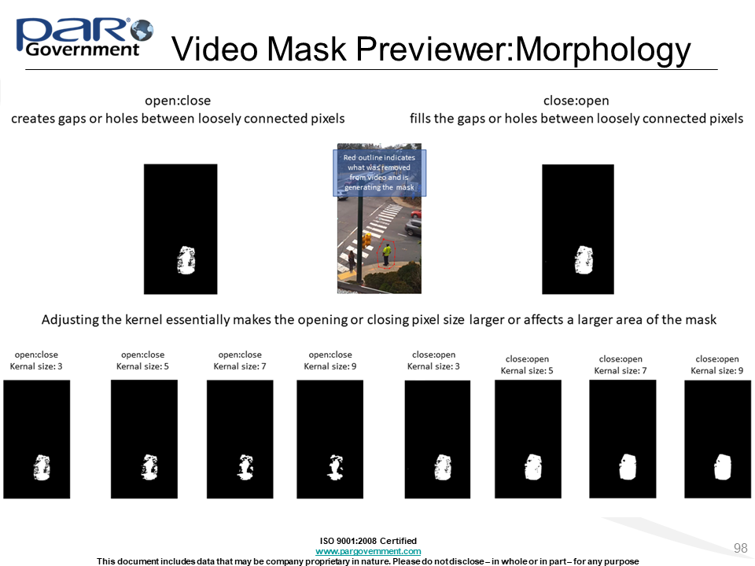

# UI

### Video Manipulation Validation Concerns

TBD

### Video Mask Tuning

####General Help

####Can I rewind the Mask Previewer to a previous frame?
Not currently. You must exit the Previewer and open it again to look at the mask for a particular frame.

####I canceled out of the Mask Previewer and now the edge is missing a mask file on validation.
If you begin writing to the mask file with the previewer and then cancel or close it, The mask file will be incomplete, 
and so be deleted automatically and noted in the log.

#### How should I read the histogram in the Mask Previewer?

The histogram represents the values in the difference mask from 0 (no difference) to 255 (complete difference.)
The threshold in red is the value where everything below it becomes 0 and everything above it becomes 255.
Increasing the gain will move the threshold further to the right, decreasing will pull it to the left.

#### What does Minimum/Maximum Threshold do?

The threshold is the difference value above which a pixel is determined to be changed, and below which is determined not.
Setting a minimum to this value will prevent the threshold from being automatically placed on the histogram
 any further to the left/right than the minimum/maximum respectively. 
 Threshold constraints are applied before gain is added, therefore it is possible to exceed the threshold constraints by using the gain parameter.

#### My Mask has a large amount of noise

Try increasing the kernel, and/or using the open:close morphology order.
You may also want to adjust the gain according to where the threshold was placed in the histogram. 

For manipulations where automatic generation is especially noisy, features significant flashing, or is inaccurate,
consider supplying a user-generated substitute mask via the videoinputmask argument in the edge edit dialog.

#### My Mask has "islands" that missed detection inside a larger area that was detected.

Try the close:open morphology order, a smaller kernel, and/or increase the gain.

#### My Histogram looks blocky

Your video files are likely compressed and there are gaps between the bins of values.
This may cause the automatic threshold selection to pick sub-optimal values for the threshold.
This problem can be handled using the minimum and maximum threshold parameters to restrict 
the range of automatic threshold selection, as well as gain.

# Empty and Global Masks

Global mask is a mask the affects a diffuse large part of an image.   Many operations are assumed global based on their 'generateMask' value.  Empty masks occur if the operation does not affect the image content  (meta-data only), the relevant remaining content is unchanged (e.g. Crop) or the operation was not recorded correctly.

Some links include a 'global' value of 'yes' or 'no'.  These links are associated with operations that may be local or global (e.g Blur).

During probe construction, masks are aligned to final images.  During this process, some masks are emptied.  A mask is empty in probe if (1) The link mask if the operation is local and empty or (2) a prior operation occluded the mask.  We made a program decision that occlusion can only occur if the area of an image aligned to mask is subsequently manipulated to remove the content (remove the prior manipulation) or paste over the content (Paste Sampled and Paste Splice).  Otherwise, the JT probe construction delivers a mask despite potential occlusion.  Thus, it is import for test production to factor in the order and depth of manipulations that affect the same local area of an image as indicated by their masks.

Is an empty mask an error?  From the perspective of probe generation: no; an empty mask is an undetectable probe.  From a journal perspective, an empty mask may indicate an operation not recorded properly.  This could mean the operation never occurred or did occur but not recorded.  In the later case, the subsequent operation's mask and resulting image will include both operations in one result.   Thus, empty mask conditions should be inspected to consider their impact.

An probe can be produced by the JT with an empty mask id

* If the a link with an operation 'removes' the contents of a mask  (e.g. occlusion) from prior link, then that link can contain an attribute *allowed_entities* mapped to a list containing source node identifier of the 'prior' link.
* The operation is crop, recapture, paste splice, paste sampled or remove.

# BATCH

### EXTENSIONS

#### Is the state of journal changed if extension fails?

No.  The project JSON file is not updated and the '--completeFile'  is not updated. The log file will have a line: "Project skipped: <projectname>".

#### Why does a core dump occur?

Projects involve many libraries such as libraw, opencv, libjpeg, and ffmpeg. Furthermore, plugins use their own libraries and dependencies.  Some libraries do not play well together (different versions) and some are not thread safe.  

In the case of a core dump, try rerunning the project be extended during the core dump in isolation using a single threaded batch extension (the default).

#### What steps should I take if a batch process is killed or core dumps?

The projects in process during the failure are most likely incomplete and are safe to rerun.  For certainty, look at the consistency between the log file, the update time for the project JSON file and the  '--completeFile' .  

The Log File will have a message referencing the project indication an update: "Project updated [1/1] <projectname>".  This message indicates the JSON is saved.  The JSON still may be saved even if the log file never received the message due to the process failure.

Next the 'complete file' should contain the finished project in the JSON is updated.  

Be sure to check the integrity of the journal JSON file, as it could be in a partial updated state.

It is a good idea to keep a backup of the project to be updated prior to an extension.  Worst case, the back up overlays the failed project and the extension is restarted.

As summary, the updates to the forementioned components occur in this order:

(1) Save Project JSON.

(2) Send Log message to log.

(3) Add project to complete file

### Creation

#### Why does a core dump occur?

Projects involve many libraries such as libraw, opencv, libjpeg, and ffmpeg. Furthermore, plugins use their own libraries and dependencies.  Some libraries do not play well together (different versions) and some are not thread safe.  

In the case of a core dump, try run single threaded. Try isolating the different media resources (images, videos, audio) being supplied to the project in separate groups by type (e.g. CR2 first, then JPG, etc.) .

#### What steps should I take if a batch process is killed or core dumps?

The resource lists is not updated, so the resources used in the projects being constructed at the time of the core dump are still available.   However, the project directories are still in existence.  The batch creation will create new directories with a date/time appended to the name.  Either remove those directories before restart or allow the tool to create the 'dated' directory.

#### What are the indicators of a project failure?

The batch tool log file contains a message "Creation of project <projectname> failed: <reason>".  

If '--keep_failed' is set, then the project directory is retained at the time of failure.  A kept project directory can help identify the root problem. As with core dumps, restarting a failed project creates a new directory if the old project direcory still exists.  The new directory includes a date/time stamp appended to the name .

Finally, a state file is presevered with all the chosen arguments in the project including media resources collected.  The name of the state file is 'failures-<datetime>.txt'.  The project may be rerun using the exact state using the '--from_state' command line argument followed by the name of the failure file.

#### How do I restart a project after a failure?

It is recommended to remove the old project directory and remove the names used media resources manually out of the associated picklist files in the '--workdir' directory.  Alternatively, every failure ends with a state file, named 'failures-<datetime>.txt', recording the state of the arguments for the batch operations at the time of the failure.   The project may be rerun using the exact state using the '--from_state' command line argument followed by the name of the failure file.

# FUTURE WISHES

1. Empty mask through operation occlusion is culled from probes (see mask_rules.checkEmptyMask's force option which is equivalent to 'empty masks are ok').